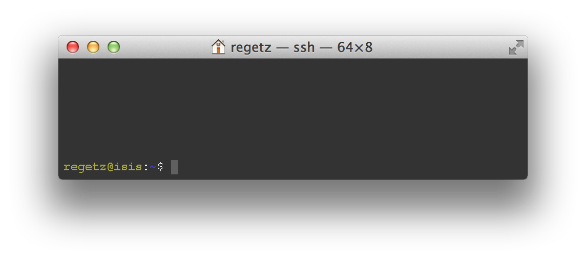
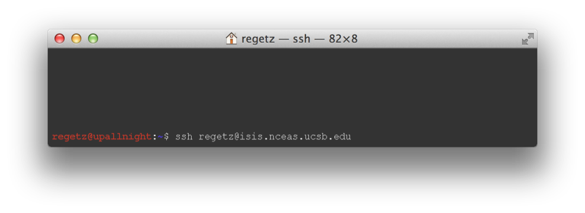

# The operating system

# All about the X

UNIX
 :  Originally developed at AT&T Bell Labs circa 1970. Has
     experienced a [contentious, fractured
     evolution](https://upload.wikimedia.org/wikipedia/commons/7/77/Unix_history-simple.svg)
POSIX
 :  think of this as a set of specifications of what an OS needs to qualify as "a Unix"

# All about the X

* OS X
 :  [is a Unix](http://unix.stackexchange.com/questions/1489/is-mac-os-x-unix)!
* Linux
 :  is _not_ fully POSIX-compliant, but certainly can be
      regarded as [functionally Unix](http://en.wikipedia.org/wiki/Unix-like)

# Some Unix hallmarks

* Multi-user, multi-process
* Separation of engine from interface
* Small tools for specific jobs
* Culture of text files and streams

# The Command Line

GUI
 :  Graphical user interface
CLI
 :  Command-line interface
 
# GUIs can be impressive

#### [Pay no attention to that man behind the curtain](http://www.youtube.com/watch?v=YWyCCJ6B2WE)

# CLIs let you get things done

# Why the CLI is worth learning

* Typically much more extensive access to features, commands, options
* Command statements can be written down, saved (scripts!)
* Easier automation
* Much "cheaper" to do work on a remote system (no need to
      transmit all the graphical stuff over the network)

# Let's connect

# Lay of the land

## Navigating and managing files/directories

* `pwd`, `ls`, `cd`
* `~`, `.`, `..`
* `mkdir`, `cp`, `mv`
* `rm`, `rmdir`

# Permissions

## All files have permissions and ownership

* Change permissions: `chmod`
* Change ownership: `chown`

# Getting help

  

* `<command> -h`, `<command> --help`
* `man`, `info`, `apropos`, `whereis`
* Search the web!

# General command syntax

### `$ command [options] [arguments]`

## where `command` must be an _executable_ file on your `PATH`
* `echo $PATH`

## and `options` can usually take two forms
* short form: `-h`
* long form: `--help`

<!--
# Elevate your permissions

#### `$ sudo vi /etc/postgresql/9.1/main/postgresql.conf`
-->

# Text editing

#### (Text rules!)

## Some editors

* `vim`
* `emacs`
* `nano`

### `$ nano .bashrc`

# Let's look at our text file

* `cat` print file(s)
* `head` print first few lines of file(s)
* `tail` print last few lines of file(s)
* `less` "pager" -- view file interactively
  

# A sampling of simple commands

* `wc` count lines, words, and/or characters
* `diff` compare two files for differences
* `sort` sort lines in a file
* `uniq` report or filter out repeated lines in a file

# Get into the flow, with pipes 

* `ls *.jpg | wc -l`
* `ls *.jpg | wc -l > jpegcount.txt`
* `diff <(sort file1.txt) <(sort file2.txt)`
* `ls foo 2>/dev/null`
* `tee`

# A sampling of more advanced utilities

* `grep` search files for text
* `sed` filter and transform text
* `find` advanced search for files/directories

# grep

# grep

## Show all lines containing "bug" in my R scripts

* `grep bug *.R`

## Now count the number of occurrences per file

* `grep -c bug *.R`

## Print the names of files that _don't_ contain bug

* `grep -vl bug *.R`

# sed

# sed

## Remove all lines containing "bug"!

* `sed '/bug/d' myscript.R`

## Call them buglets, not bugs!

* `sed 's/bug/buglet/g' myscript.R`

## Actually, only do this on lines starting with #

* `sed '/#/ s/bug/buglet/g' myscript.R`

# find

#### Like Rover, the Windows search dog. But more useful.

# find

## Show me my pdfs!

* `find . -iname "*.pdf"`

## Which files are larger than 10GB?

* `find . -size +10G -ls`

# Getting things done

* Process management
    * Like Windows Task Manager, OSX Activity Monitor
    * `top`, `ps`, `jobs`
* Foreground and background
* Stay persistent with `screen`
* Need to go visual?
    * X11 forwarding, x2go, VNC

# Online resources

* http://www.ibm.com/developerworks/linux/library/l-lpic1-v3-103-1/
* http://linuxcommand.org/learning_the_shell.php
* http://www.tuxfiles.org/linuxhelp/cli.html
* http://www.linfo.org/command_line_lesson_1.html
* [Free book!](http://linuxcommand.org/tlcl.php)
