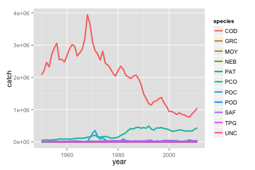
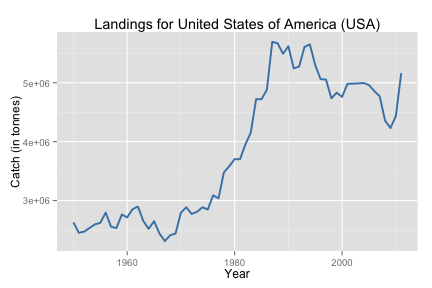
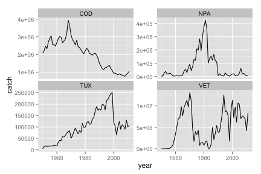

---
title: A example of using the rfisheries package to look at catch decline
author: Karthik Ram
output:
  pdf_document:
    toc: false
    highlight: default
---  


 
 ```r
 knitr::opts_chunk$set(
  comment = " ",
  error = FALSE,
  tidy = FALSE
 )
 ```

# Fisheries landings example

First you'll need to install a few packages if you don't already have them


```r
install.packages(c("plyr", "ggplot2", "rfisheries"))
```


```r
# Next load up the package
library(rfisheries)
library(plyr) # for manipulating the data
library(ggplot2) # for visualizing the data
```

You start off by downloading a complete list of species from the FAO database


```r
species_list <- of_species_codes()
```


```r
head(species_list)
```

```
           scientific_name   taxocode a3_code isscaap
  1     Petromyzon marinus 1020100101     LAU      25
  2   Lampetra fluviatilis 1020100201     LAR      25
  3    Lampetra tridentata 1020100202     LAO      25
  4 Ichthyomyzon unicuspis 1020100401     LAY      25
  5    Eudontomyzon mariae 1020100501     LAF      25
  6      Geotria australis 1020100701     LAE      25
               english_name
  1             Sea lamprey
  2           River lamprey
  3         Pacific lamprey
  4          Silver lamprey
  5 Ukrainian brook lamprey
  6         Pouched lamprey
```


Now you've got a list of 11562 commerically valuable species. Let's write a small function to search for species by their common names


```r
fish_search <- function(query = NULL, species_list) {
	if(!is.null(query)) {
		species_list[grep(query, species_list$english_name), ]
	}
}
```

We'll create another function to fail gracefully if data are not available for a particular species or country.


```r
Sys.setlocale('LC_ALL','C') 
```

```
  [1] "C/C/C/C/C/en_US.UTF-8"
```

```r
safe_landings <- failwith(NULL, of_landings)
# failwith is a function in the plyr package.
```

Now let's search for all the lamprey species


```r
fish_search("lamprey", species_list)
```

```
              scientific_name   taxocode a3_code isscaap
  1        Petromyzon marinus 1020100101     LAU      25
  2      Lampetra fluviatilis 1020100201     LAR      25
  3       Lampetra tridentata 1020100202     LAO      25
  4    Ichthyomyzon unicuspis 1020100401     LAY      25
  5       Eudontomyzon mariae 1020100501     LAF      25
  6         Geotria australis 1020100701     LAE      25
  7           Mordacia mordax 1020100801     LAK      25
  8       Caspiomyzon wagneri 1020100901     LAW      25
  9 Lethenteron camtschaticum 1020101101     LSZ      25
               english_name
  1             Sea lamprey
  2           River lamprey
  3         Pacific lamprey
  4          Silver lamprey
  5 Ukrainian brook lamprey
  6         Pouched lamprey
  7      Australian lamprey
  8         Caspian lamprey
  9          Arctic lamprey
```
or perhaps the cod species


```r
cods <- fish_search(" cod$", species_list)
# The $ means that cod should be the end of the name. 
# This avoids grabbing crocodiles for example.
cods
```

```
                    scientific_name   taxocode a3_code isscaap
  3281         Muraenolepis microps 1480100101     MOY      32
  3282      Muraenolepis marmoratus 1480100102     MVC      32
  3283   Muraenolepis microcephalus 1480100103     MWS      32
  3284     Muraenolepis orangiensis 1480100104     MWO      32
  3296          Momonatira globosus 1480200901     MMG      32
  3307    Tripterophycis gilchristi 1480201901     TPG      32
  3312       Lepidion microcephalus 1480202005     LMF      32
  3317      Bregmaceros mcclellandi 1480301801     UNC      32
  3320                 Gadus morhua 1480400202     COD      32
  3321          Gadus macrocephalus 1480400211     PCO      32
  3322                   Gadus ogac 1480400212     GRC      32
  3344            Eleginus gracilis 1480401202     SAF      32
  3351             Boreogadus saida 1480401901     POC      32
  3352         Arctogadus glacialis 1480402201     ATG      32
  3353          Arctogadus borisovi 1480402202     ATV      32
  3366          Trisopterus minutus 1480403202     POD      32
  3508           Melanonus gracilis 1480700101     MLG      32
  3510        Euclichthys polynemus 1481000101     EUY      32
  4346        Maccullochella peelii 1700817601     MCP      13
  4347 Maccullochella macquariensis 1700817602     MLQ      13
  4348          Maccullochella ikei 1700817603     MLK      13
  5930 Paranotothenia microlepidota 1709240003     NHJ      33
  5938       Patagonotothen ramsayi 1709244002     PAT      34
  6165            Parapercis colias 1720919602     NEB      33
                 english_name
  3281     Smalleye moray cod
  3282      Marbled moray cod
  3283    Smallhead moray cod
  3284   Patagonian moray cod
  3296            Tadpole cod
  3307          Grenadier cod
  3312       Small-headed cod
  3317            Unicorn cod
  3320           Atlantic cod
  3321            Pacific cod
  3322          Greenland cod
  3344            Saffron cod
  3351              Polar cod
  3352              Artic cod
  3353      East Siberian cod
  3366               Poor cod
  3508            Pelagic cod
  3510              Eucla cod
  4346             Murray cod
  4347              Trout cod
  4348 Eastern freshwater cod
  5930              Black cod
  5938  Longtail Southern cod
  6165   New Zealand blue cod
```

Now let's get data for these species


```r
cod_data <- ldply(cods$a3_code, function(x) {
	 safe_landings(species = x)
})
```


This will only retrieve data if avaialble for the few species that we subset from the larger list. We can plot these out:


```r
ggplot(cod_data, aes(year, catch, color = species)) + geom_line(size = 1.1)
```

 

<!--  -->


Now we can do the same for countries as well.


```r
country_list <- of_country_codes()
# Grabs a list of countries and their respective country codes
head(country_list)
```

```
           country iso3c
  1    Afghanistan   AFG
  2        Albania   ALB
  3        Algeria   DZA
  4 American Samoa   ASM
  5        Andorra   AND
  6         Angola   AGO
```


Want landings data for USA?


```r
usa_data <- of_landings(country = "USA")
fish_plot(usa_data)
```

 

<!-- #  -->

We can do some interesting comparisons of species. Let's examine the Anchovy fisheries in the Northern and Southern hemispheres (California versus Peru) and a couple of other commercially interesting fish species


```r
anchovies <- fish_search("anchovy", species_list)
head(anchovies)
```

```
              scientific_name   taxocode a3_code isscaap
  1078 Engraulis encrasicolus 1210600201     ANE      35
  1079    Engraulis japonicus 1210600202     JAN      35
  1080     Engraulis anchoita 1210600206     ANA      35
  1081       Engraulis mordax 1210600207     NPA      35
  1082      Engraulis ringens 1210600208     VET      35
  1083     Engraulis capensis 1210600212     ANC      35
                       english_name
  1078             European anchovy
  1079             Japanese anchovy
  1080            Argentine anchovy
  1081          Californian anchovy
  1082 Anchoveta(=Peruvian anchovy)
  1083     Southern African anchovy
```


```r
# Let's grab the two interesting anchovy fisheries (California and Peru) along with Cod and Tuna.
who <- c("TUX", "COD", "VET", "NPA")
dat <- ldply(who, function(x) safe_landings(species = x))
```

We can plot these data out:


```r
ggplot(dat, aes(year, catch)) + geom_line() + 
facet_wrap(~species, scales = "free_y") 
```

 


 <!--  -->

Why did the perivuan fishery collapse? See: [http://en.wikipedia.org/wiki/Overfishing](http://en.wikipedia.org/wiki/Overfishing) under instances
[Also see](https://www.google.com/search?q=peruvian+anchovy+collapse).


