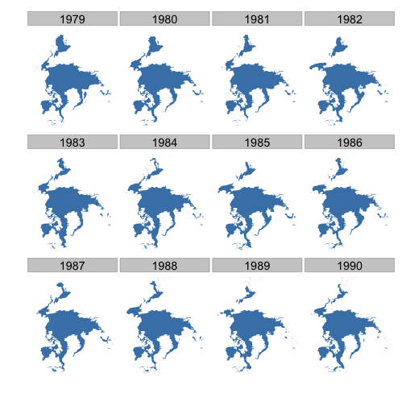

## NOAA climate data: Plot sea ice data

The `rnoaa` package allows you to retrieve a whole range of data from the National Ocean Atmosphere Administration. To install this package on your local machine, run:


```r
install.packages("rnoaa")
# or install a development version with
library(devtools)
install_github("ropensci/rnoaa")
```
 
 In this example we obtain 12 years of sea ice data for the North Pole and map it for the month of April. 


```r
library(rnoaa)
library(scales)
library(ggplot2)
library(plyr)
```

### Get URLs for data


```r
urls <- seaiceeurls(mo = 'Apr', pole = 'N')[1:12]
```

### Download sea ice data


```r
results <- llply(urls, noaa_seaice, storepath = "~/")
names(results) <- seq(1979, 1990, 1)
final_data <- ldply(results)
```

### Plot data


```r
ggplot(final_data, aes(long, lat, group = group)) + 
  geom_polygon(fill = "steelblue") +
  theme_ice() +
  facet_wrap(~ .id)
```

 
