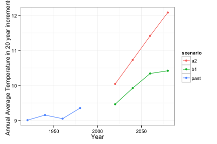
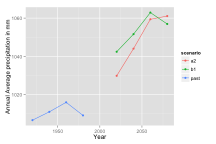
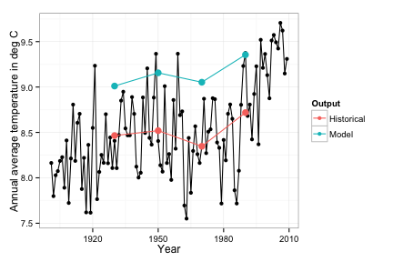
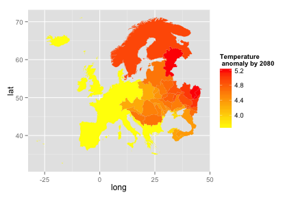
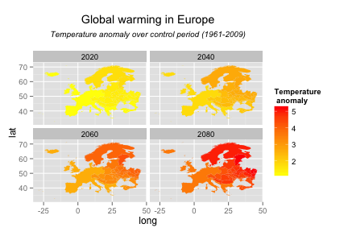

Introduction to rWBclimate
========================================================

The [ROpenSci](http://www.ropensci.org) package `rWBclimate` provides full access to all the climate data provided by the [World Bank](http://www.worldbank.org/) via their [climate data api](http://data.worldbank.org/developers/climate-data-api).  The package provides an easy way to download data for research and visualization purposes.  While the package provides access to a tremendous amount of data we wil focus on a few simple examples.  Full documentation and detailed examples can be found at the [package website](https://github.com/ropensci/rWBclimate).


We begin by loading the necessary libraries.

```r
library(rWBclimate)
library(ggplot2)
```


### Downloading ensemble climate data

The package can download data for any of the 13 major climate models, but it also offers provides access to ensemble data derived from all models.  We'll focus on this for our examples.  Model data is provided both for the past as a backcasting, and for the future.  Output for both only comes in 20 year averages.  Here we'll plot temperature data for Great Britain for the past as well as two [climate scenarios](http://climatesanity.wordpress.com/tag/global-depletion-of-groundwater-resources/), A2 and B1.


```r
### Grab temp data
gbr.dat.t <- get_ensemble_temp("GBR", "annualavg", 1900, 2100)
### Subset to just the median percentile
gbr.dat.t <- subset(gbr.dat.t, gbr.dat.t$percentile == 50)
gbr.dat.t$data <- unlist(gbr.dat.t$data)
## Plot and note the past is the same for each scenario
ggplot(gbr.dat.t, aes(x = fromYear, y = data, group = scenario, colour = scenario)) + 
geom_point() + 
geom_path() + 
theme_bw() + 
xlab("Year") + 
ylab("Annual Average Temperature in 20 year increments")
```

 

As you can see the A2 scenario of unchecked growth predicts a higher annual average temperature.  We can look at the same kind of data except this time examining changes in precipitation.


```r
gbr.dat.p <- get_ensemble_precip("GBR", "annualavg", 1900, 2100)

gbr.dat.p <- subset(gbr.dat.p,gbr.dat.p$percentile == 50)
gbr.dat.p$data <- unlist(gbr.dat.p$data)
ggplot(gbr.dat.p,aes(x = fromYear, 
	y = data, 
	group = scenario, 
	colour = scenario))+ 
geom_point() + 
geom_path() + 
xlab("Year") + 
ylab("Annual Average precipitation in mm")
```

 

Here the difference between predicted increases in precipitation are less drastic when comparing the two different scenarios.

### Downloading historical data

The api also provides access to historical data.  In this example we'll download historical temperature data, then overlay it with backcasted model data to see how it compares.  Historical data can be output in various formats, and we'll be looking at annual averages.  Model backcast data only comes in 20 increments, so we'll overlay the raw data with not only model backcast averages but also averages of the historical data during the same window.


```r
### Let's compare historical data with our backcasted data

gbr.modelpast <- subset(gbr.dat.t,gbr.dat.t$scenario == "past")
gbr.historical <- get_historical_temp("GBR", "year")
### Plot create historical plot
hist.plot <- ggplot(gbr.historical, aes(x = year,y = data)) + 
geom_point() + 
geom_path()

### Create a centroid for the past 
gbr.modelpast$centroid <-  round((gbr.modelpast$fromYear + gbr.modelpast$toYear) / 2)

### Create averages based the same windows used in the model output for comparison
win_avg <- function(from, to, df){
  win <- subset(df, df$year >= from & df$year <= to)
  
  return(c(mean(win$data),round(mean(c(from,to)))))
}
hist.avg <- matrix(0,ncol=2,nrow=0)
for(i in 1:dim(gbr.modelpast)[1]){
   hist.avg <- rbind(hist.avg,win_avg(gbr.modelpast$fromYear[i], gbr.modelpast$toYear[i],gbr.historical))
}
colnames(hist.avg) <- c("data","centroid")

### Create new dataframe of historical averages and model averages
hist.comp <- rbind(hist.avg,cbind(gbr.modelpast$data,gbr.modelpast$centroid))
hist.comp <- as.data.frame(hist.comp)
hist.comp$Output <- c(rep("Historical",4),rep("Model",4))

### overlay the averages with the original raw data plot
hist.plot <- hist.plot + geom_point(data=hist.comp,aes(x=centroid,y=data,colour=Output,group=Output,size=3))+geom_path(data=hist.comp,aes(x=centroid,y=data,colour=Output,group=Output)) +  guides(size=FALSE)

hist.plot + xlab("Year") + ylab("Annual average temperature in deg C") + theme_bw()
```

 


With this plot its easy to see that the ensemble predictions overestimate past temperatures but generally have predicted the trends correctly, just up shifted by about 0.5 degrees.

### Making maps.

One of the most useful aspects of the climate api is the ability to create maps of climate data.  You can access  data on two spatial scales, Country, and watershed basin.  Watershed basin will provide greater spatial resolution than country (though not in all instances).  The package has convenient data frames with lists of all the basins or countries in all the continents.  Here we'll look at a map of expected precipitation anomalies in Europe.  Maps work by downloading kml files, storing them locally and then reading them into R.  It relies on having a local directory which can be set with `options(kmlpath = <yourpath>)`.  After that a few function calls will download the requested map, link climate data to the map and plot it for you (also note that the initial downloads of kml files can take some time)


```r
# Set local path  
options(kmlpath = "/tmp")
#create dataframe with mapping data to plot
eu_basin <- create_map_df(Eur_basin)
```

```
#> 
  |                                                                       
  |                                                                 |   0%
  |                                                                       
  |=                                                                |   2%
  |                                                                       
  |==                                                               |   4%
  |                                                                       
  |====                                                             |   6%
  |                                                                       
  |=====                                                            |   8%
  |                                                                       
  |======                                                           |   9%
  |                                                                       
  |=======                                                          |  11%
  |                                                                       
  |=========                                                        |  13%
  |                                                                       
  |==========                                                       |  15%
  |                                                                       
  |===========                                                      |  17%
  |                                                                       
  |============                                                     |  19%
  |                                                                       
  |=============                                                    |  21%
  |                                                                       
  |===============                                                  |  23%
  |                                                                       
  |================                                                 |  25%
  |                                                                       
  |=================                                                |  26%
  |                                                                       
  |==================                                               |  28%
  |                                                                       
  |====================                                             |  30%
  |                                                                       
  |=====================                                            |  32%
  |                                                                       
  |======================                                           |  34%
  |                                                                       
  |=======================                                          |  36%
  |                                                                       
  |=========================                                        |  38%
  |                                                                       
  |==========================                                       |  40%
  |                                                                       
  |===========================                                      |  42%
  |                                                                       
  |============================                                     |  43%
  |                                                                       
  |=============================                                    |  45%
  |                                                                       
  |===============================                                  |  47%
  |                                                                       
  |================================                                 |  49%
  |                                                                       
  |=================================                                |  51%
  |                                                                       
  |==================================                               |  53%
  |                                                                       
  |====================================                             |  55%
  |                                                                       
  |=====================================                            |  57%
  |                                                                       
  |======================================                           |  58%
  |                                                                       
  |=======================================                          |  60%
  |                                                                       
  |========================================                         |  62%
  |                                                                       
  |==========================================                       |  64%
  |                                                                       
  |===========================================                      |  66%
  |                                                                       
  |============================================                     |  68%
  |                                                                       
  |=============================================                    |  70%
  |                                                                       
  |===============================================                  |  72%
  |                                                                       
  |================================================                 |  74%
  |                                                                       
  |=================================================                |  75%
  |                                                                       
  |==================================================               |  77%
  |                                                                       
  |====================================================             |  79%
  |                                                                       
  |=====================================================            |  81%
  |                                                                       
  |======================================================           |  83%
  |                                                                       
  |=======================================================          |  85%
  |                                                                       
  |========================================================         |  87%
  |                                                                       
  |==========================================================       |  89%
  |                                                                       
  |===========================================================      |  91%
  |                                                                       
  |============================================================     |  92%
  |                                                                       
  |=============================================================    |  94%
  |                                                                       
  |===============================================================  |  96%
  |                                                                       
  |================================================================ |  98%
  |                                                                       
  |=================================================================| 100%
```

```r
# Get some data
eu_basin_dat <- get_ensemble_temp(Eur_basin, "annualanom", 2080, 2100)
## Subset data to just one scenario, and one percentile so we have 1 piece of information per spatial unit
eu_basin_dat <- subset(eu_basin_dat, eu_basin_dat$scenario == "a2" & eu_basin_dat$percentile == 50)

#link map dataframe to climate data

eu_map <- climate_map(eu_basin, eu_basin_dat, return_map = T)
eu_map + scale_fill_continuous("Temperature \n anomaly by 2080", low = "yellow", high = "red") 
```

 


The temperature anomaly mapped shows a general increase in temperature over the control period of 1961 - 2009.  The geratest increase looks to be coming in the interior of Eastern Europe.  Now that we have the basic map data download it's easy to bind new data to the existing map dataframe with the kml cooridates.  Let's say we want to look at this map of anomalies but for all time periods to see how it increases, we can easily do that with a couple of for loops.


```r
# First we get all the future time periods
eu_basin_dat <- get_ensemble_temp(Eur_basin, "annualanom", 2000, 2100)
#subset the data to one observation per spatial unit (basin)
eu_basin_dat <- subset(eu_basin_dat, eu_basin_dat$scenario == "a2" & eu_basin_dat$percentile == 50)
### Next we need to create a dataframe that binds each year of data to the map dataframe
### Bind it all together and create master dataframe with an identifier for each year.

# get unique years
years <- unique(eu_basin_dat$fromYear)

#create an initial data.frame to join other years to.

master_map <-  climate_map(eu_basin, eu_basin_dat[eu_basin_dat$fromYear==years[1],], return_map = F)
master_map$year <- rep(years[1],dim(master_map)[1])

for(i in 2:length(years)){
## Note that return map is False meaning a dataframe is returned not a ggplot2 map  

  tmp_map <- climate_map(eu_basin, eu_basin_dat[eu_basin_dat$fromYear==years[i],], return_map = F)
  tmp_map$year <- rep(years[i], dim(tmp_map)[1])
  master_map <- rbind(master_map, tmp_map)
}

ggplot(master_map,
	aes(x = long,y = lat,group = group,fill = data)) +
geom_polygon() + 
facet_wrap( ~ year) + 
scale_fill_continuous("Temperature \n anomaly", low = "yellow", high = "red") + 
ggtitle(expression(atop("Global warming in Europe", 
  atop(italic("Temperature anomaly over control period (1961-2009)"), ""))))
```

 


Here the increase with each time period is obvious, especially since all the anomalies are plotted on the same temperature scale. 
