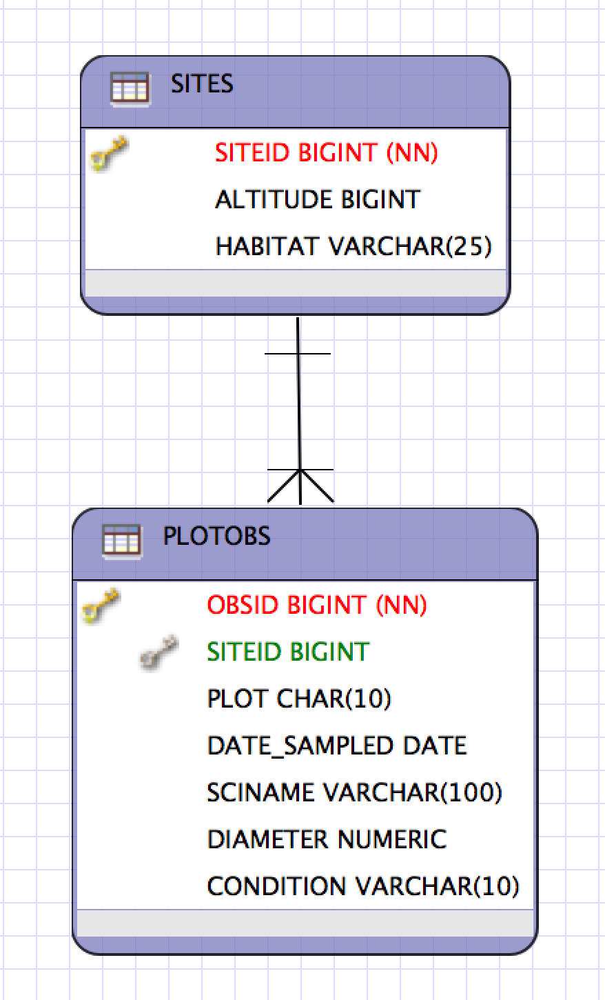

# Basics of SQL, the Structured Query Language

## Objectives

- Learn to create a simple database, populate it, and query it
- Gain basic understanding of integrity constraints and their utility

## About the database

The database you will create contains two tables that are linked by one of thier shared columns, siteid, as shown in the figure below:



## Create postgres user accounts for all participants

In order to connect to a postgres database, you must have an account that grants you permission to connect, and to perform the other operations you need, such as creating tables or reading data from tables.  In general, users can be created with the commandline utility:

- createuser -d -e -E -l -r -s <username>

Specifically, I have already created accounts for course participants using a bash script as follows:

```bash
for un in `cat ~jones/nceasSI-accounts`; do echo "Creating $un..."; createuser -d -e -E -l -r -s $un; echo "Done with $un."; done
```

## Creating a database

Users that are authorized can create a database, either at the main sql prompt, or via the `createdb` command line utility.  Use the following commands to create a database for yourself, ensuring that you change the name of your database to use your username.

```bash
# Create a database for yourself and connect to it
createdb testdb_jones # Ensure this uses your own username
psql testdb_jones
\?
\d
\pset pager
```

## Create a table

Once you have a database for which you have write access, you can create tables, add data to those tables, and manipulate them. Tables are relations that contain data following a set of constraints that you establish in a table definition.  

```sql
-- Create a table
CREATE TABLE sites (
	siteid INT8,
	altitude INT8, 
	habitat VARCHAR(25), 
	CONSTRAINT site_pk PRIMARY KEY (siteid)
);
```

## Inspect the table that was created

Postgres provides tools for inspecting the objects in your schema, and you can see the list of all of your tables and other objects using `\d`. Once the object exists, you can issye a `SQL SELECT` to view the data in the table.  In this case, the table has no rows yet, and so the `SELECT` command shows zero rows returned.

```sql
\d
\d sites
SELECT * FROM sites;
```

## Insert data

Inserting data can be done one row at a time using the `INSERT` command.  With this command, you name the table to be inserted into, the fields that you want to populate, and a list of values to be populated.  Depending on how the table was created, some columns may have default values set which will be created even if that row is not manipulated.

```sql
-- INSERT SOME DATA INTO THE TABLE
INSERT INTO sites (siteid, altitude, habitat) VALUES (1, 722, 'riparian');
INSERT INTO sites (siteid, altitude, habitat) VALUES (2, 805, 'riparian');
INSERT INTO sites (siteid, altitude, habitat) VALUES (3, 887, 'mixed');
INSERT INTO sites (siteid, altitude, habitat) VALUES (4, 920, 'mixed');
INSERT INTO sites (siteid, altitude, habitat) VALUES (5, 110, 'forest');
INSERT INTO sites (siteid, altitude, habitat) VALUES (6, 192, 'mixed');
INSERT INTO sites (siteid, altitude, habitat) VALUES (7, 121, 'forest');
INSERT INTO sites (siteid, altitude, habitat) VALUES (8, 108, 'riparian');
INSERT INTO sites (siteid, altitude, habitat) VALUES (9, 722, 'riparian');
INSERT INTO sites (siteid, altitude, habitat) VALUES (10, 805, 'riparian');
INSERT INTO sites (siteid, altitude, habitat) VALUES (11, 887, 'mixed');
INSERT INTO sites (siteid, altitude, habitat) VALUES (12, 920, 'mixed');
INSERT INTO sites (siteid, altitude, habitat) VALUES (13, 110, 'forest');
INSERT INTO sites (siteid, altitude, habitat) VALUES (14, 192, 'mixed');
INSERT INTO sites (siteid, altitude, habitat) VALUES (15, 121, 'forest');
INSERT INTO sites (siteid, altitude, habitat) VALUES (16, 108, 'riparian');
INSERT INTO sites (siteid, altitude, habitat) VALUES (17, 722, 'riparian');
INSERT INTO sites (siteid, altitude, habitat) VALUES (18, 805, 'riparian');
INSERT INTO sites (siteid, altitude, habitat) VALUES (19, 887, 'mixed');
INSERT INTO sites (siteid, altitude, habitat) VALUES (20, 920, 'mixed');
INSERT INTO sites (siteid, altitude, habitat) VALUES (21, 110, 'forest');
INSERT INTO sites (siteid, altitude, habitat) VALUES (22, 192, 'mixed');
INSERT INTO sites (siteid, altitude, habitat) VALUES (23, 121, 'forest');
INSERT INTO sites (siteid, altitude, habitat) VALUES (24, 108, 'riparian');
INSERT INTO sites (siteid, altitude, habitat) VALUES (25, 722, 'riparian');
INSERT INTO sites (siteid, altitude, habitat) VALUES (26, 805, 'riparian');
INSERT INTO sites (siteid, altitude, habitat) VALUES (27, 887, 'mixed');
INSERT INTO sites (siteid, altitude, habitat) VALUES (28, 920, 'mixed');
INSERT INTO sites (siteid, altitude, habitat) VALUES (29, 110, 'forest');
INSERT INTO sites (siteid, altitude, habitat) VALUES (30, 192, 'mixed');
INSERT INTO sites (siteid, altitude, habitat) VALUES (31, 121, 'forest');
INSERT INTO sites (siteid, altitude, habitat) VALUES (32, 108, 'riparian');
```

## How to query

Queries against database tables are performed using the `SELECT` command, which allows you to specify which tables to query, and any query conditions to be met.  For example, start with a simple select that just returns all of the rows of the `sites` table.  Then issue queries that select the 'habitat' column from the sites table.  And finally, select the 'habitat' column, and sort it.

```sql
-- SIMPLE SELECTs
SELECT * from sites;
SELECT habitat from sites;
SELECT habitat from sites order by habitat;
```

## Adding constraints

The `WHERE` clause is used to impose constraints on the query, such that all constraints must be met for any given row to be returned.  Below, we first search for all plots with an `altitude` value greater than 500, and then where the `habitat` value matches the string `scrub`.

```sql
-- SELECT with a constraint
SELECT * from sites where altitude > 500;
SELECT * from sites where habitat = 'scrub';
```

## More complex constraints

Complex constraints can be constructed using boolean operators to logically combine clauses. All clauses must evaluate to `TRUE` for a constraint to be satisfied.  For example, below we request records with two constraints, which both must be met.

```sql
-- SELECT with a more complex constraint
SELECT * from sites where habitat = 'scrub' AND altitude > 500;
```
## Group functions

SQL provides the ability to group results using a grouping variable along with an aggregation function.  This allows calculation of the sum of a column grouped by another column (e.g., sum of tree height by species).  In the example below, we count the number of records in each habitat.  To use `group by`, records must be sorted by the grouping variables, which is accomplished with the `order by` clause.

```sql
-- SELECT with an aggregation function using group by
SELECT habitat, count(*) from sites group by habitat order by habitat;
```

## Integrity constraints

One of the major benefits of SQL is the ability to specify constraints within the definition of a schema.  These constraints must be satisfied to allow any new data record to be inserted or updated.  Constraints come in several types including:

- Primary key
    - One or more columns whose values uniquely identify a row and that are used to reference a row in various operations; values must be unique.
- Unique key
    - All values in the column must be unique.
- Foreign key
    - All values in the column must refer to the primary key in another table.
- Check constraint
    - Constraints can be specified which check values against a specified set of criteria.

In the example, below, we try to insert a new record into the `sites` table, which fails because it would cause a data corruption issue -- in this case, the `siteid` is already in use and therefore would not be unique, which is required for primary keys. Foreign keys are highly useful to ensure that records are not inserted into a child table without first inserting the proper contextual information in a parent table.

```sql
-- INTEGRITY CONSTRAINTS: PRIMARY KEY ENFORCEMENT
INSERT INTO sites (siteid, altitude, habitat) VALUES (1, 721, 'scrub');
```

## Updating records

Once a record has been created, it can be modified by calling `update` and using the primary key to choose the rows to be changed.  Think twice before doing this, as it can result in data loss.

```sql
-- UPDATE
UPDATE sites SET altitude=721 where siteid=1;
```

## Deleting a record

Sometimes you simply inserted the wrong data.  `delete` will remove rows that match a particular set of criteria.

```sql
-- DELETE
INSERT INTO sites (siteid, altitude, habitat) VALUES (33, 121, 'forest');
SELECT count(*) from sites;
DELETE from sites where siteid=33;
```

## Transactions

Transactions are a mechanism for ensuring the success of all operations or none, which aids in maintaining data integrity. When a transaction has been started, you can modify the tables in the database with impunity, and nobody will see your changes until you decide to `commit` the changes to the database.  Before that happens, you can choose to `rollback`, which discards all of your pending changes and returns the data to its original state.  Transactions allow programmers to ensure that a consistent set of changes is applied across multiple tables.

```sql
-- TRANSACTIONS
INSERT INTO sites (siteid, altitude, habitat) VALUES (33, 121, 'forest');
START TRANSACTION;
   DELETE FROM sites WHERE siteid > 7;
SELECT * from sites order by siteid;
-- Oh Crap!
ROLLBACK;
SELECT * from sites order by siteid;
```

```sql
-- Try again to delete the right set of rows
START TRANSACTION;
DELETE FROM sites WHERE siteid > 32;
SELECT * from sites order by siteid;
COMMIT;
```

## Using `COPY` for larger databases

Using `INSERT` for large numbers of rows can be slow.  Not only are you issuing many `INSET` statements, but each of these takes time and resources, slowing down the whole database.  Instead, it is possible to copy an entire data table into the database by simoly using the `SQL COPY` operator.  There is a tremendous efficiency gain in using `COPY` over `INSERT` for largish data sets.

```sql
-- CREATE ANOTHER TABLE THAT WILL BE RELATED TO site
CREATE TABLE plotobs (
	obsid INT8,
	siteid INT8, 
	plot CHAR(10), 
	date_sampled DATE, 
	sciname VARCHAR(100),
	diameter NUMERIC,
	condition VARCHAR(10),
	CONSTRAINT plotobs_pk PRIMARY KEY (obsid),
	CONSTRAINT plotobs_site_fk FOREIGN KEY (siteid) REFERENCES sites
);
```
Note that we now have two tables in our database, linked by a foreign key on the `siteid` column which references the `sites` table.

```sql
-- Batch load data from a CSV file
COPY plotobs FROM '/home/jones/training/2014-oss/day-08/sql-basics/plotobs.csv' DELIMITER ',' CSV HEADER;
```

## Calulating an average

Using our new table, we can calcualte the average over a group, in this case `sciname`.

```sql
-- ANOTHER AGGREGATION QUERY
SELECT sciname, avg(diameter) FROM plotobs GROUP BY sciname ORDER BY sciname;
```

## Inner joins

Now that we have two tables in the database, you can see that it is possible to combine our knowlegde using a `JOIN` to merge data from the two tables. This is a simple `INNER JOIN`, and is a powerful part of using a relational database. Only rows that have keys matching in both tables will be returned from the query (e.g., any rows in the `sites` table that lack corresponding rows in the `plotobs` table will be omitted by the query.  This is in contrast to an `OUTER JOIN` where you can choose to include some non-matching records.

```sql
-- SIMPLE INNER JOIN
SELECT s.siteid, s.altitude, p.obsid, p.plot, p.sciname, p.diameter FROM sites s, plotobs p WHERE p.siteid = s.siteid;
```

## Concatenate query results

Append the results of one query to another.  This is frequently useful when you want to combine results form multiple source tables.

```sql
-- UNION for concatenating results of two queries
SELECT * FROM plotobs WHERE diameter > 30
UNION
SELECT * FROM plotobs WHERE diameter < 10;
```

## Intersect query results

Take only the common results from two queries.  This allows you to find a set of matching rows that meets one of two or more incompatible constraints.  In the example, we return all rows where the diameter is both greater than 30 and less than 35, which could have also more easily be done using an `AND` clause in the `WHERE` constraint.
```sql
-- INTERSECT for finding common results between two queries
SELECT * FROM plotobs WHERE diameter > 30
INTERSECT
SELECT * FROM plotobs WHERE diameter < 35;
```

-- NOT COVERING OUTER JOINS

