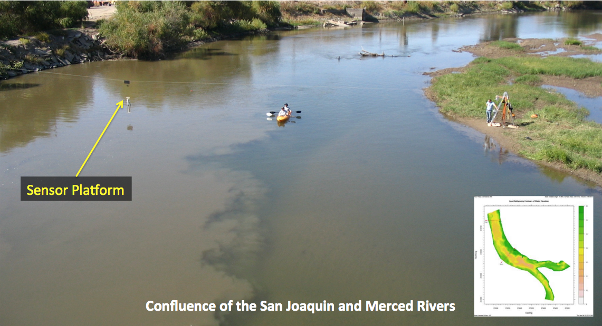
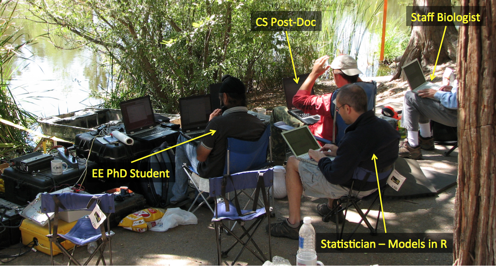

#Python Introduction and Overview


---

#What is Python

**According to python.org** 

* "*Python is a programming language that lets you work quickly and integrate systems more effectively*"

**According to wikipedia** 

* "*Python is a general-purpose, high-level programming language emphasizing code readability and allows programmers to express concepts in fewer lines of code than would be possible in languages such as C*"

---

#Python is

**More or less whatever you need it to be** 

* Supports multiple programming paradigms, including object-oriented, imperative and functional programming or procedural styles
* Features a dynamic type system and automatic memory management and has a large and comprehensive standard library
* Often used as a scripting language, but is also used in a wide range of non-scripting contexts
* Designed to be highly extensible
* Can be packaged into standalone executables (Py2exe or Pyinstaller)
* Python interpreters are available for many operating systems

---

#Basic Philosophy
####[PEP 20](https://www.python.org/dev/peps/pep-0020/) (The Zen of Python)
* Beautiful is better than ugly
* Explicit is better than implicit
* Simple is better than complex
* Complex is better than complicated
* ...

```
>>> import this
```

---

#Why should I care about Python?

##How is it useful to me?

---

#Honest answer is... I don't know...

##but I can tell you why it was useful for me

---

**Project:** Map river transects for velocity and water quality fields. The coupled fields allow computation of total fluxes of constituents, such as salinity, so that precise mass balances may be determined across upstream and downstream transects to provide a better understanding of mixing processes, reaeration, and ground-water surface water interactions.




---

Python offers a variety of relatively easy to use libraries that allowed us to create interfaces to all of our sensors and platforms, stream and aggregate sensor data, and analyze the data in real-time. 


---

Python served as the underlying glue to pull together all of our system controls, sensor integration and I/O agent for populating the R-models (Rpy) used in the data analysis and to automate decision making.



---

#Roadmap for today
* These slides
* A few tutorials on some Python Basics
* A look at Scientfic Python (more slides)
* Setting up a local virtual environment
* IPython and IPython Notebook
	* R versus Python
	* Rpy2

---

#Python Basics - Tutorial 1
* Command line python
* Numbers
* Strings
* Lists
* First steps towards programming

---

#Python Basics - Tutorial 2
* Control Flow Tools
	* if Statements
	* for Statements
	* range() Function
	* break and continue Statements, and else clauses on Loops
	* pass Statements
	* Defining Functions

---

#Python Basics - Tutorial 3
* Classes
	* Names and Objects
	* Scopes and Namespaces
	* First look at Classes
* Inheritance
* Private Variables and Class-local References
* Iterators
* Generators
* Links to additional tutorials 

---

#Python Basics - Tutorial 4
* VirtualBox
* xubuntu VM
	* zip file ~ 1.7 GB
	* unzipped file ~ 6.15 GB
* Prep for Day 11

---

#Python Basics - Tutorial 5
* IPython install on VM using apt-get
* self directed links to tutorials

---

#Python Basics - Tutorial 6
* Round 1: R vs Python example using IPython Notebook and R-Studio
* additional links to Rounds 2 and 3

---

#Python Basics - Tutorial 7
* Rpy2 Install on VM using apt-get
* self directect links to tutorials

---

End


