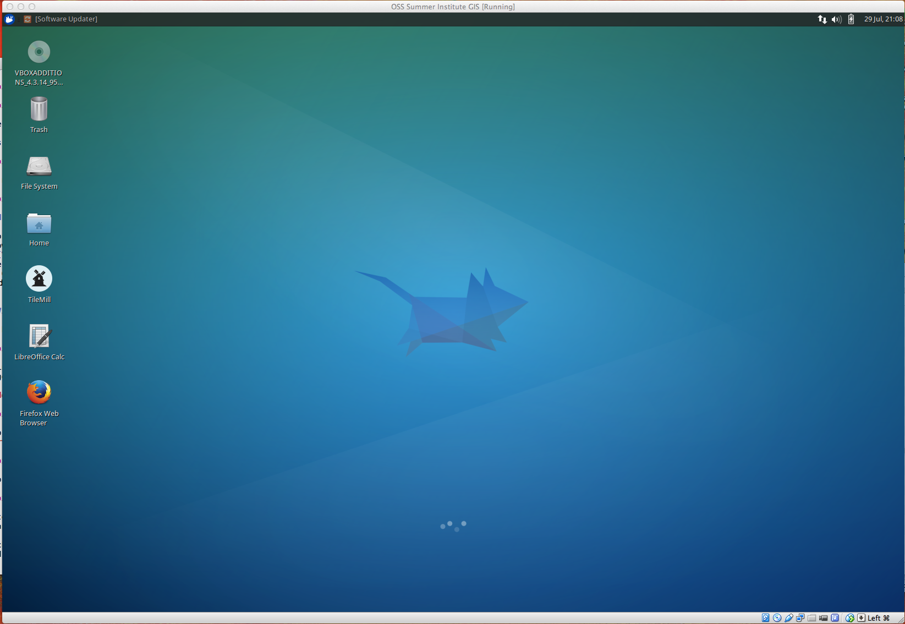
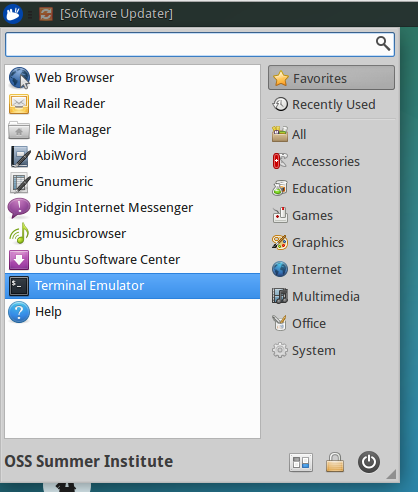
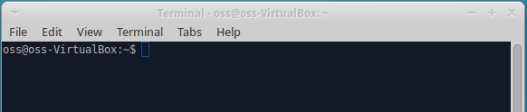
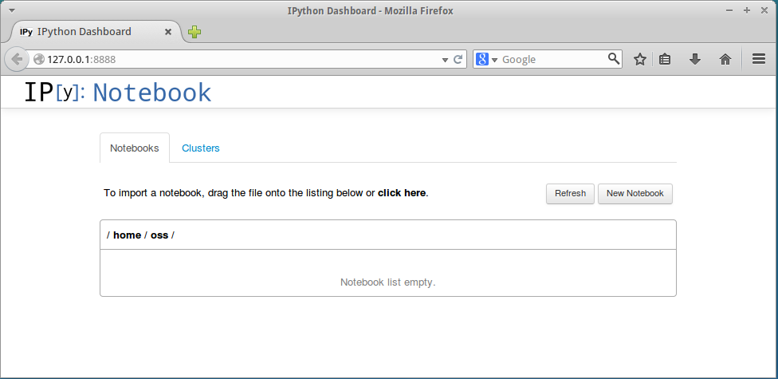

#IPython and IPython Notebook

---

###Tutorials on the web
[nbviewer.ipython.org](http://nbviewer.ipython.org/github/ipython/ipython/tree/3607712653c66d63e0d7f13f073bde8c0f209ba8/docs/examples/notebooks)

Introductory notebook **00_notebook_tour.ipynb** located in [docs](../docs)

---

###IPython is available from isis

SSH into **isis.nceas.ucsb.edu** and invoke Python from command line where *\<username>* is your username

```
[~]$ ssh <username>@isis.nceas.ucsb.edu
<username>@isis.nceas.ucsb.edu's password: 
Welcome to Ubuntu 12.04.4 LTS (GNU/Linux 3.2.0-67-generic x86_64)
...
<username>@isis:~$ 
<username>@isis:~$ ipython
Python 2.7.3 (default, Feb 27 2014, 19:58:35) 
Type "copyright", "credits" or "license" for more information.

IPython 0.12.1 -- An enhanced Interactive Python.
?         -> Introduction and overview of IPython's features.
%quickref -> Quick reference.
help      -> Python's own help system.
object?   -> Details about 'object', use 'object??' for extra details.

In [1]: 
>>> 
```

And you may use this freely thorughout the duration of the summer institute

###However, IPython Notebook is not installed on isis

```
<username>@isis:~$ 
<username>@isis:~$ ipython notebook
Could not start notebook. Please install ipython-notebook
<username>@isis:~$ 
```

But we can use the local VM that we've made and install IPython Notebook there

---

###Installing IPython Notebook onto your local VM

Once launched from the VirtualBox Manager your VM should look like this



We want to see if IPython Notebook is installed on the VM. Launch the Terminal Emulator (click icon in upper left portion of the window to reveal options)





Try to launch ipython and ipython notebook (Neither should be available)

```
oss@oss-VirtualBox:~$ ipython
The program 'ipython' is currently not installed. You can install it by typing:
sudo apt-get install ipython
oss@oss-VirtualBox:~$ ipython notebook
The program 'ipython' is currently not installed. You can install it by typing:
sudo apt-get install ipython
oss@oss-VirtualBox:~$ 
```

We want to install the full SciPy stack, including ipython and ipython notebook which may take a little time depending on your platform and network connection

At the commmand line enter: ```sudo apt-get install python-numpy python-scipy python-matplotlib ipython ipython-notebook python-pandas python-sympy python-nose```

When prompted for password enter: ```oss```


```
oss@oss-VirtualBox:~$ 
oss@oss-VirtualBox:~$ sudo apt-get install python-numpy python-scipy python-matplotlib ipython ipython-notebook python-pandas python-sympy python-nose
[sudo] password for oss: 
Reading package lists... Done
Building dependency tree       
Reading state information... Done
python-numpy is already the newest version.
python-matplotlib is already the newest version.
python-matplotlib set to manually installed.
python-scipy is already the newest version.
The following extra packages will be installed:
  dvipng fonts-cabin fonts-comfortaa fonts-font-awesome fonts-freefont-otf
  fonts-gfs-artemisia fonts-gfs-complutum fonts-gfs-didot
  fonts-gfs-neohellenic fonts-gfs-olga fonts-gfs-solomos fonts-inconsolata
  fonts-junicode fonts-lato fonts-linuxlibertine fonts-lmodern fonts-lobster
  fonts-lobstertwo fonts-mathjax fonts-oflb-asana-math fonts-stix
  ipython-notebook-common javascript-common libdsdp-5.8gf libglpk36
  libjs-highlight libjs-jquery libjs-jquery-ui libjs-marked libjs-mathjax
  liblz4-1 libpgm-5.1-0 libptexenc1 libruby1.9.1 libsnappy1 libyaml-0-2
  libzmq3 lmodern luatex python-antlr python-bs4 python-cvxopt python-jinja2
  python-joblib python-markupsafe python-mysqldb python-numexpr
  python-openpyxl python-pandas-lib python-patsy python-simplegeneric
  python-simplejson python-statsmodels python-statsmodels-lib python-tables
  python-tables-data python-tables-lib python-tornado python-xlrd python-xlwt
  python-zmq ruby ruby1.9.1 tex-common texlive-base texlive-binaries
  texlive-fonts-extra texlive-fonts-extra-doc texlive-luatex ttf-adf-accanthis
  ttf-adf-gillius
Suggested packages:
  fontforge ipython-doc ipython-qtconsole pandoc pgf apache2 lighttpd httpd
  libiodbc2-dev libjs-jquery-ui-docs fonts-mathjax-extras libjs-mathjax-doc
  python-jinja2-doc mysql-server-5.1 mysql-server python-mysqldb-dbg
  python-coverage python-nose-doc python-pandas-doc python-patsy-doc
  python-tables-doc python-netcdf vitables ri ruby-dev ruby1.9.1-examples
  ri1.9.1 graphviz ruby1.9.1-dev ruby-switch debhelper perl-tk cm-super
The following NEW packages will be installed:
  dvipng fonts-cabin fonts-comfortaa fonts-font-awesome fonts-freefont-otf
  fonts-gfs-artemisia fonts-gfs-complutum fonts-gfs-didot
  fonts-gfs-neohellenic fonts-gfs-olga fonts-gfs-solomos fonts-inconsolata
  fonts-junicode fonts-lato fonts-linuxlibertine fonts-lmodern fonts-lobster
  fonts-lobstertwo fonts-mathjax fonts-oflb-asana-math fonts-stix ipython
  ipython-notebook ipython-notebook-common javascript-common libdsdp-5.8gf
  libglpk36 libjs-highlight libjs-jquery libjs-jquery-ui libjs-marked
  libjs-mathjax liblz4-1 libpgm-5.1-0 libptexenc1 libruby1.9.1 libsnappy1
  libyaml-0-2 libzmq3 lmodern luatex python-antlr python-bs4 python-cvxopt
  python-jinja2 python-joblib python-markupsafe python-mysqldb python-nose
  python-numexpr python-openpyxl python-pandas python-pandas-lib python-patsy
  python-simplegeneric python-simplejson python-statsmodels
  python-statsmodels-lib python-sympy python-tables python-tables-data
  python-tables-lib python-tornado python-xlrd python-xlwt python-zmq ruby
  ruby1.9.1 tex-common texlive-base texlive-binaries texlive-fonts-extra
  texlive-fonts-extra-doc texlive-luatex ttf-adf-accanthis ttf-adf-gillius
0 upgraded, 76 newly installed, 0 to remove and 22 not upgraded.
Need to get 309 MB of archives.
After this operation, 821 MB of additional disk space will be used.
Do you want to continue? [Y/n] Y
Get:1 http://us.archive.ubuntu.com/ubuntu/ trusty/universe fonts-lato all 1.104-4 [243 kB]
Get:2 http://us.archive.ubuntu.com/ubuntu/ trusty/universe fonts-mathjax all 2.3-1 [959 kB]
Get:3 http://us.archive.ubuntu.com/ubuntu/ trusty/universe libglpk36 amd64 4.52.1-2build1 [384 kB]
Get:4 http://us.archive.ubuntu.com/ubuntu/ trusty/universe libpgm-5.1-0 amd64 5.1.118-1~dfsg-0.1ubuntu3 [156 kB]
Get:5 http://us.archive.ubuntu.com/ubuntu/ trusty/main libyaml-0-2 amd64 0.1.4-3ubuntu3 [48.2 kB]
Get:6 http://us.archive.ubuntu.com/ubuntu/ trusty/universe libzmq3 amd64 4.0.4+dfsg-2 [129 kB]
Get:7 http://us.archive.ubuntu.com/ubuntu/ trusty/main tex-common all 4.04 [621 kB]
Get:8 http://us.archive.ubuntu.com/ubuntu/ trusty/main fonts-lmodern all 2.004.4-3 [6,380 kB]
Get:9 http://us.archive.ubuntu.com/ubuntu/ trusty/main lmodern all 2.004.4-3 [12.4 MB]
Get:10 http://us.archive.ubuntu.com/ubuntu/ trusty/universe libjs-mathjax all 2.3-1 [5,396 kB]
Get:11 http://us.archive.ubuntu.com/ubuntu/ trusty/universe liblz4-1 amd64 0.0~r114-2ubuntu1 [16.1 kB]
Get:12 http://us.archive.ubuntu.com/ubuntu/ trusty/main libptexenc1 amd64 2013.20130729.30972-2build3 [33.9 kB]
Get:13 http://us.archive.ubuntu.com/ubuntu/ trusty/main texlive-binaries amd64 2013.20130729.30972-2build3 [4,059 kB]
Get:14 http://us.archive.ubuntu.com/ubuntu/ trusty/main dvipng amd64 1.14-2 [81.4 kB]
Get:15 http://us.archive.ubuntu.com/ubuntu/ trusty/universe fonts-cabin all 1.5-2 [140 kB]
Get:16 http://us.archive.ubuntu.com/ubuntu/ trusty/universe fonts-comfortaa all 2.003-1 [131 kB]
Get:17 http://us.archive.ubuntu.com/ubuntu/ trusty/universe fonts-font-awesome all 4.0.0~dfsg-1 [266 kB]
Get:18 http://us.archive.ubuntu.com/ubuntu/ trusty/universe fonts-freefont-otf all 20120503-4 [3,068 kB]
Get:19 http://us.archive.ubuntu.com/ubuntu/ trusty/universe fonts-gfs-artemisia all 1.1-5 [260 kB]
Get:20 http://us.archive.ubuntu.com/ubuntu/ trusty/universe fonts-gfs-complutum all 1.1-6 [41.6 kB]
Get:21 http://us.archive.ubuntu.com/ubuntu/ trusty/universe fonts-gfs-didot all 1.1-6 [278 kB]
Get:22 http://us.archive.ubuntu.com/ubuntu/ trusty/universe fonts-gfs-neohellenic all 1.1-6 [215 kB]
Get:23 http://us.archive.ubuntu.com/ubuntu/ trusty/universe fonts-gfs-olga all 1.1-5 [33.4 kB]
Get:24 http://us.archive.ubuntu.com/ubuntu/ trusty/universe fonts-gfs-solomos all 1.1-5 [40.7 kB]
Get:25 http://us.archive.ubuntu.com/ubuntu/ trusty/universe fonts-inconsolata all 001.010-5 [61.8 kB]
Get:26 http://us.archive.ubuntu.com/ubuntu/ trusty/universe fonts-junicode all 0.7.8-2 [642 kB]
Get:27 http://us.archive.ubuntu.com/ubuntu/ trusty/universe fonts-linuxlibertine all 5.3.0-2 [1,688 kB]
Get:28 http://us.archive.ubuntu.com/ubuntu/ trusty/universe fonts-lobster all 2.0-2 [38.7 kB]
Get:29 http://us.archive.ubuntu.com/ubuntu/ trusty/universe fonts-lobstertwo all 2.0-2 [92.7 kB]
Get:30 http://us.archive.ubuntu.com/ubuntu/ trusty/universe fonts-oflb-asana-math all 000.907-6 [246 kB]
Get:31 http://us.archive.ubuntu.com/ubuntu/ trusty/main python-simplegeneric all 0.8.1-1 [11.5 kB]
Get:32 http://us.archive.ubuntu.com/ubuntu/ trusty/universe ipython all 1.2.1-2 [588 kB]
Get:33 http://us.archive.ubuntu.com/ubuntu/ trusty/universe libjs-highlight all 7.4+ds-1 [140 kB]
Get:34 http://us.archive.ubuntu.com/ubuntu/ trusty/main libjs-jquery all 1.7.2+dfsg-2ubuntu1 [78.8 kB]
Get:35 http://us.archive.ubuntu.com/ubuntu/ trusty/universe libjs-jquery-ui all 1.10.1+dfsg-1 [458 kB]
Get:36 http://us.archive.ubuntu.com/ubuntu/ trusty/universe libjs-marked all 0.3.1+dfsg-1 [12.5 kB]
Get:37 http://us.archive.ubuntu.com/ubuntu/ trusty/universe ipython-notebook-common all 1.2.1-2 [629 kB]
Get:38 http://us.archive.ubuntu.com/ubuntu/ trusty/main python-markupsafe amd64 0.18-1build2 [14.3 kB]
Get:39 http://us.archive.ubuntu.com/ubuntu/ trusty/main python-jinja2 all 2.7.2-2 [161 kB]
Get:40 http://us.archive.ubuntu.com/ubuntu/ trusty/main python-tornado all 3.1.1-1ubuntu2 [215 kB]
Get:41 http://us.archive.ubuntu.com/ubuntu/ trusty/universe python-zmq amd64 14.0.1-1build2 [175 kB]
Get:42 http://us.archive.ubuntu.com/ubuntu/ trusty/universe ipython-notebook all 1.2.1-2 [28.9 kB]
Get:43 http://us.archive.ubuntu.com/ubuntu/ trusty/main javascript-common all 11 [6,066 B]
Get:44 http://us.archive.ubuntu.com/ubuntu/ trusty/main ruby all 1:1.9.3.4 [5,334 B]
Get:45 http://us.archive.ubuntu.com/ubuntu/ trusty/main ruby1.9.1 amd64 1.9.3.484-2ubuntu1 [35.6 kB]
Get:46 http://us.archive.ubuntu.com/ubuntu/ trusty/main libruby1.9.1 amd64 1.9.3.484-2ubuntu1 [2,667 kB]
Get:47 http://us.archive.ubuntu.com/ubuntu/ trusty/main luatex amd64 0.76.0-3ubuntu1 [2,776 kB]
Get:48 http://us.archive.ubuntu.com/ubuntu/ trusty/universe python-antlr all 2.7.7+dfsg-5 [20.0 kB]
Get:49 http://us.archive.ubuntu.com/ubuntu/ trusty/main python-bs4 all 4.2.1-1ubuntu2 [58.0 kB]
Get:50 http://us.archive.ubuntu.com/ubuntu/ trusty/universe libdsdp-5.8gf amd64 5.8-9.1 [223 kB]
Get:51 http://us.archive.ubuntu.com/ubuntu/ trusty/universe python-cvxopt amd64 1.1.4-1.2 [1,303 kB]
Get:52 http://us.archive.ubuntu.com/ubuntu/ trusty/universe python-joblib all 0.7.1-1 [50.0 kB]
Get:53 http://us.archive.ubuntu.com/ubuntu/ trusty/main python-mysqldb amd64 1.2.3-2ubuntu1 [55.4 kB]
Get:54 http://us.archive.ubuntu.com/ubuntu/ trusty/main python-nose all 1.3.1-2 [119 kB]
Get:55 http://us.archive.ubuntu.com/ubuntu/ trusty/universe python-numexpr amd64 2.2.2-4build1 [121 kB]
Get:56 http://us.archive.ubuntu.com/ubuntu/ trusty/universe python-openpyxl all 1.7.0+ds1-1 [75.2 kB]
Get:57 http://us.archive.ubuntu.com/ubuntu/ trusty/universe python-pandas-lib amd64 0.13.1-2ubuntu2 [1,118 kB]
Get:58 http://us.archive.ubuntu.com/ubuntu/ trusty/universe python-pandas all 0.13.1-2ubuntu2 [1,077 kB]
Get:59 http://us.archive.ubuntu.com/ubuntu/ trusty/universe python-patsy all 0.2.1-3 [142 kB]
Get:60 http://us.archive.ubuntu.com/ubuntu/ trusty/main python-simplejson amd64 3.3.1-1ubuntu6 [54.7 kB]
Get:61 http://us.archive.ubuntu.com/ubuntu/ trusty/universe python-sympy all 0.7.4.1-1 [2,826 kB]
Get:62 http://us.archive.ubuntu.com/ubuntu/ trusty/main libsnappy1 amd64 1.1.0-1ubuntu1 [11.2 kB]
Get:63 http://us.archive.ubuntu.com/ubuntu/ trusty/universe python-tables-lib amd64 3.1.1-0ubuntu1 [331 kB]
Get:64 http://us.archive.ubuntu.com/ubuntu/ trusty/universe python-tables-data all 3.1.1-0ubuntu1 [42.2 kB]
Get:65 http://us.archive.ubuntu.com/ubuntu/ trusty/universe python-tables all 3.1.1-0ubuntu1 [327 kB]
Get:66 http://us.archive.ubuntu.com/ubuntu/ trusty/universe python-xlrd all 0.9.2-1 [143 kB]
Get:67 http://us.archive.ubuntu.com/ubuntu/ trusty/universe python-xlwt all 0.7.5+debian1-1 [83.5 kB]
Get:68 http://us.archive.ubuntu.com/ubuntu/ trusty/main texlive-base all 2013.20140215-1 [16.2 MB]
Get:69 http://us.archive.ubuntu.com/ubuntu/ trusty/universe fonts-stix all 1.1.0-1 [763 kB]
Get:70 http://us.archive.ubuntu.com/ubuntu/ trusty/universe ttf-adf-gillius all 0.20090423-2 [400 kB]
Get:71 http://us.archive.ubuntu.com/ubuntu/ trusty/universe ttf-adf-accanthis all 0.20090423-2 [401 kB]
Get:72 http://us.archive.ubuntu.com/ubuntu/ trusty/universe texlive-fonts-extra all 2013.20140215-2 [172 MB]
Get:73 http://us.archive.ubuntu.com/ubuntu/ trusty/main texlive-fonts-extra-doc all 2013.20140215-2 [53.3 MB]
Get:74 http://us.archive.ubuntu.com/ubuntu/ trusty/main texlive-luatex all 2013.20140215-1 [8,204 kB]
Get:75 http://us.archive.ubuntu.com/ubuntu/ trusty/universe python-statsmodels-lib amd64 0.5.0+git13-g8e07d34-1ubuntu2 [63.7 kB]
Get:76 http://us.archive.ubuntu.com/ubuntu/ trusty/universe python-statsmodels all 0.5.0+git13-g8e07d34-1ubuntu2 [3,362 kB]
Fetched 309 MB in 8min 18s (619 kB/s)                                          
Extracting templates from packages: 100%
Preconfiguring packages ...
Selecting previously unselected package fonts-lato.
(Reading database ... 216280 files and directories currently installed.)
Preparing to unpack .../fonts-lato_1.104-4_all.deb ...
Unpacking fonts-lato (1.104-4) ...
Selecting previously unselected package fonts-mathjax.
Preparing to unpack .../fonts-mathjax_2.3-1_all.deb ...
Unpacking fonts-mathjax (2.3-1) ...
Selecting previously unselected package libglpk36:amd64.
Preparing to unpack .../libglpk36_4.52.1-2build1_amd64.deb ...
Unpacking libglpk36:amd64 (4.52.1-2build1) ...
Selecting previously unselected package libpgm-5.1-0:amd64.
Preparing to unpack .../libpgm-5.1-0_5.1.118-1~dfsg-0.1ubuntu3_amd64.deb ...
Unpacking libpgm-5.1-0:amd64 (5.1.118-1~dfsg-0.1ubuntu3) ...
Selecting previously unselected package libyaml-0-2:amd64.
Preparing to unpack .../libyaml-0-2_0.1.4-3ubuntu3_amd64.deb ...
Unpacking libyaml-0-2:amd64 (0.1.4-3ubuntu3) ...
Selecting previously unselected package libzmq3:amd64.
Preparing to unpack .../libzmq3_4.0.4+dfsg-2_amd64.deb ...
Unpacking libzmq3:amd64 (4.0.4+dfsg-2) ...
Selecting previously unselected package tex-common.
Preparing to unpack .../tex-common_4.04_all.deb ...
Unpacking tex-common (4.04) ...
Selecting previously unselected package fonts-lmodern.
Preparing to unpack .../fonts-lmodern_2.004.4-3_all.deb ...
Unpacking fonts-lmodern (2.004.4-3) ...
Selecting previously unselected package lmodern.
Preparing to unpack .../lmodern_2.004.4-3_all.deb ...
Unpacking lmodern (2.004.4-3) ...
Selecting previously unselected package libjs-mathjax.
Preparing to unpack .../libjs-mathjax_2.3-1_all.deb ...
Unpacking libjs-mathjax (2.3-1) ...
Selecting previously unselected package liblz4-1:amd64.
Preparing to unpack .../liblz4-1_0.0~r114-2ubuntu1_amd64.deb ...
Unpacking liblz4-1:amd64 (0.0~r114-2ubuntu1) ...
Selecting previously unselected package libptexenc1.
Preparing to unpack .../libptexenc1_2013.20130729.30972-2build3_amd64.deb ...
Unpacking libptexenc1 (2013.20130729.30972-2build3) ...
Selecting previously unselected package texlive-binaries.
Preparing to unpack .../texlive-binaries_2013.20130729.30972-2build3_amd64.deb ...
Unpacking texlive-binaries (2013.20130729.30972-2build3) ...
Selecting previously unselected package dvipng.
Preparing to unpack .../dvipng_1.14-2_amd64.deb ...
Unpacking dvipng (1.14-2) ...
Selecting previously unselected package fonts-cabin.
Preparing to unpack .../fonts-cabin_1.5-2_all.deb ...
Unpacking fonts-cabin (1.5-2) ...
Selecting previously unselected package fonts-comfortaa.
Preparing to unpack .../fonts-comfortaa_2.003-1_all.deb ...
Unpacking fonts-comfortaa (2.003-1) ...
Selecting previously unselected package fonts-font-awesome.
Preparing to unpack .../fonts-font-awesome_4.0.0~dfsg-1_all.deb ...
Unpacking fonts-font-awesome (4.0.0~dfsg-1) ...
Selecting previously unselected package fonts-freefont-otf.
Preparing to unpack .../fonts-freefont-otf_20120503-4_all.deb ...
Unpacking fonts-freefont-otf (20120503-4) ...
Selecting previously unselected package fonts-gfs-artemisia.
Preparing to unpack .../fonts-gfs-artemisia_1.1-5_all.deb ...
Unpacking fonts-gfs-artemisia (1.1-5) ...
Selecting previously unselected package fonts-gfs-complutum.
Preparing to unpack .../fonts-gfs-complutum_1.1-6_all.deb ...
Unpacking fonts-gfs-complutum (1.1-6) ...
Selecting previously unselected package fonts-gfs-didot.
Preparing to unpack .../fonts-gfs-didot_1.1-6_all.deb ...
Unpacking fonts-gfs-didot (1.1-6) ...
Selecting previously unselected package fonts-gfs-neohellenic.
Preparing to unpack .../fonts-gfs-neohellenic_1.1-6_all.deb ...
Unpacking fonts-gfs-neohellenic (1.1-6) ...
Selecting previously unselected package fonts-gfs-olga.
Preparing to unpack .../fonts-gfs-olga_1.1-5_all.deb ...
Unpacking fonts-gfs-olga (1.1-5) ...
Selecting previously unselected package fonts-gfs-solomos.
Preparing to unpack .../fonts-gfs-solomos_1.1-5_all.deb ...
Unpacking fonts-gfs-solomos (1.1-5) ...
Selecting previously unselected package fonts-inconsolata.
Preparing to unpack .../fonts-inconsolata_001.010-5_all.deb ...
Unpacking fonts-inconsolata (001.010-5) ...
Selecting previously unselected package fonts-junicode.
Preparing to unpack .../fonts-junicode_0.7.8-2_all.deb ...
Unpacking fonts-junicode (0.7.8-2) ...
Selecting previously unselected package fonts-linuxlibertine.
Preparing to unpack .../fonts-linuxlibertine_5.3.0-2_all.deb ...
Unpacking fonts-linuxlibertine (5.3.0-2) ...
Selecting previously unselected package fonts-lobster.
Preparing to unpack .../fonts-lobster_2.0-2_all.deb ...
Unpacking fonts-lobster (2.0-2) ...
Selecting previously unselected package fonts-lobstertwo.
Preparing to unpack .../fonts-lobstertwo_2.0-2_all.deb ...
Unpacking fonts-lobstertwo (2.0-2) ...
Selecting previously unselected package fonts-oflb-asana-math.
Preparing to unpack .../fonts-oflb-asana-math_000.907-6_all.deb ...
Unpacking fonts-oflb-asana-math (000.907-6) ...
Selecting previously unselected package python-simplegeneric.
Preparing to unpack .../python-simplegeneric_0.8.1-1_all.deb ...
Unpacking python-simplegeneric (0.8.1-1) ...
Selecting previously unselected package ipython.
Preparing to unpack .../ipython_1.2.1-2_all.deb ...
Unpacking ipython (1.2.1-2) ...
Selecting previously unselected package libjs-highlight.
Preparing to unpack .../libjs-highlight_7.4+ds-1_all.deb ...
Unpacking libjs-highlight (7.4+ds-1) ...
Selecting previously unselected package libjs-jquery.
Preparing to unpack .../libjs-jquery_1.7.2+dfsg-2ubuntu1_all.deb ...
Unpacking libjs-jquery (1.7.2+dfsg-2ubuntu1) ...
Selecting previously unselected package libjs-jquery-ui.
Preparing to unpack .../libjs-jquery-ui_1.10.1+dfsg-1_all.deb ...
Unpacking libjs-jquery-ui (1.10.1+dfsg-1) ...
Selecting previously unselected package libjs-marked.
Preparing to unpack .../libjs-marked_0.3.1+dfsg-1_all.deb ...
Unpacking libjs-marked (0.3.1+dfsg-1) ...
Selecting previously unselected package ipython-notebook-common.
Preparing to unpack .../ipython-notebook-common_1.2.1-2_all.deb ...
Unpacking ipython-notebook-common (1.2.1-2) ...
Selecting previously unselected package python-markupsafe.
Preparing to unpack .../python-markupsafe_0.18-1build2_amd64.deb ...
Unpacking python-markupsafe (0.18-1build2) ...
Selecting previously unselected package python-jinja2.
Preparing to unpack .../python-jinja2_2.7.2-2_all.deb ...
Unpacking python-jinja2 (2.7.2-2) ...
Selecting previously unselected package python-tornado.
Preparing to unpack .../python-tornado_3.1.1-1ubuntu2_all.deb ...
Unpacking python-tornado (3.1.1-1ubuntu2) ...
Selecting previously unselected package python-zmq.
Preparing to unpack .../python-zmq_14.0.1-1build2_amd64.deb ...
Unpacking python-zmq (14.0.1-1build2) ...
Selecting previously unselected package ipython-notebook.
Preparing to unpack .../ipython-notebook_1.2.1-2_all.deb ...
Unpacking ipython-notebook (1.2.1-2) ...
Selecting previously unselected package javascript-common.
Preparing to unpack .../javascript-common_11_all.deb ...
Unpacking javascript-common (11) ...
Selecting previously unselected package ruby.
Preparing to unpack .../ruby_1%3a1.9.3.4_all.deb ...
Unpacking ruby (1:1.9.3.4) ...
Selecting previously unselected package ruby1.9.1.
Preparing to unpack .../ruby1.9.1_1.9.3.484-2ubuntu1_amd64.deb ...
Unpacking ruby1.9.1 (1.9.3.484-2ubuntu1) ...
Selecting previously unselected package libruby1.9.1.
Preparing to unpack .../libruby1.9.1_1.9.3.484-2ubuntu1_amd64.deb ...
Unpacking libruby1.9.1 (1.9.3.484-2ubuntu1) ...
Selecting previously unselected package luatex.
Preparing to unpack .../luatex_0.76.0-3ubuntu1_amd64.deb ...
Unpacking luatex (0.76.0-3ubuntu1) ...
Selecting previously unselected package python-antlr.
Preparing to unpack .../python-antlr_2.7.7+dfsg-5_all.deb ...
Unpacking python-antlr (2.7.7+dfsg-5) ...
Selecting previously unselected package python-bs4.
Preparing to unpack .../python-bs4_4.2.1-1ubuntu2_all.deb ...
Unpacking python-bs4 (4.2.1-1ubuntu2) ...
Selecting previously unselected package libdsdp-5.8gf.
Preparing to unpack .../libdsdp-5.8gf_5.8-9.1_amd64.deb ...
Unpacking libdsdp-5.8gf (5.8-9.1) ...
Selecting previously unselected package python-cvxopt.
Preparing to unpack .../python-cvxopt_1.1.4-1.2_amd64.deb ...
Unpacking python-cvxopt (1.1.4-1.2) ...
Selecting previously unselected package python-joblib.
Preparing to unpack .../python-joblib_0.7.1-1_all.deb ...
Unpacking python-joblib (0.7.1-1) ...
Selecting previously unselected package python-mysqldb.
Preparing to unpack .../python-mysqldb_1.2.3-2ubuntu1_amd64.deb ...
Unpacking python-mysqldb (1.2.3-2ubuntu1) ...
Selecting previously unselected package python-nose.
Preparing to unpack .../python-nose_1.3.1-2_all.deb ...
Unpacking python-nose (1.3.1-2) ...
Selecting previously unselected package python-numexpr.
Preparing to unpack .../python-numexpr_2.2.2-4build1_amd64.deb ...
Unpacking python-numexpr (2.2.2-4build1) ...
Selecting previously unselected package python-openpyxl.
Preparing to unpack .../python-openpyxl_1.7.0+ds1-1_all.deb ...
Unpacking python-openpyxl (1.7.0+ds1-1) ...
Selecting previously unselected package python-pandas-lib.
Preparing to unpack .../python-pandas-lib_0.13.1-2ubuntu2_amd64.deb ...
Unpacking python-pandas-lib (0.13.1-2ubuntu2) ...
Selecting previously unselected package python-pandas.
Preparing to unpack .../python-pandas_0.13.1-2ubuntu2_all.deb ...
Unpacking python-pandas (0.13.1-2ubuntu2) ...
Selecting previously unselected package python-patsy.
Preparing to unpack .../python-patsy_0.2.1-3_all.deb ...
Unpacking python-patsy (0.2.1-3) ...
Selecting previously unselected package python-simplejson.
Preparing to unpack .../python-simplejson_3.3.1-1ubuntu6_amd64.deb ...
Unpacking python-simplejson (3.3.1-1ubuntu6) ...
Selecting previously unselected package python-sympy.
Preparing to unpack .../python-sympy_0.7.4.1-1_all.deb ...
Unpacking python-sympy (0.7.4.1-1) ...
Selecting previously unselected package libsnappy1.
Preparing to unpack .../libsnappy1_1.1.0-1ubuntu1_amd64.deb ...
Unpacking libsnappy1 (1.1.0-1ubuntu1) ...
Selecting previously unselected package python-tables-lib.
Preparing to unpack .../python-tables-lib_3.1.1-0ubuntu1_amd64.deb ...
Unpacking python-tables-lib (3.1.1-0ubuntu1) ...
Selecting previously unselected package python-tables-data.
Preparing to unpack .../python-tables-data_3.1.1-0ubuntu1_all.deb ...
Unpacking python-tables-data (3.1.1-0ubuntu1) ...
Selecting previously unselected package python-tables.
Preparing to unpack .../python-tables_3.1.1-0ubuntu1_all.deb ...
Unpacking python-tables (3.1.1-0ubuntu1) ...
Selecting previously unselected package python-xlrd.
Preparing to unpack .../python-xlrd_0.9.2-1_all.deb ...
Unpacking python-xlrd (0.9.2-1) ...
Selecting previously unselected package python-xlwt.
Preparing to unpack .../python-xlwt_0.7.5+debian1-1_all.deb ...
Unpacking python-xlwt (0.7.5+debian1-1) ...
Selecting previously unselected package texlive-base.
Preparing to unpack .../texlive-base_2013.20140215-1_all.deb ...
Unpacking texlive-base (2013.20140215-1) ...
Selecting previously unselected package fonts-stix.
Preparing to unpack .../fonts-stix_1.1.0-1_all.deb ...
Unpacking fonts-stix (1.1.0-1) ...
Selecting previously unselected package ttf-adf-gillius.
Preparing to unpack .../ttf-adf-gillius_0.20090423-2_all.deb ...
Unpacking ttf-adf-gillius (0.20090423-2) ...
Selecting previously unselected package ttf-adf-accanthis.
Preparing to unpack .../ttf-adf-accanthis_0.20090423-2_all.deb ...
Unpacking ttf-adf-accanthis (0.20090423-2) ...
Selecting previously unselected package texlive-fonts-extra.
Preparing to unpack .../texlive-fonts-extra_2013.20140215-2_all.deb ...
Unpacking texlive-fonts-extra (2013.20140215-2) ...
Selecting previously unselected package texlive-fonts-extra-doc.
Preparing to unpack .../texlive-fonts-extra-doc_2013.20140215-2_all.deb ...
Unpacking texlive-fonts-extra-doc (2013.20140215-2) ...
Selecting previously unselected package texlive-luatex.
Preparing to unpack .../texlive-luatex_2013.20140215-1_all.deb ...
Unpacking texlive-luatex (2013.20140215-1) ...
Selecting previously unselected package python-statsmodels-lib.
Preparing to unpack .../python-statsmodels-lib_0.5.0+git13-g8e07d34-1ubuntu2_amd64.deb ...
Unpacking python-statsmodels-lib (0.5.0+git13-g8e07d34-1ubuntu2) ...
Selecting previously unselected package python-statsmodels.
Preparing to unpack .../python-statsmodels_0.5.0+git13-g8e07d34-1ubuntu2_all.deb ...
Unpacking python-statsmodels (0.5.0+git13-g8e07d34-1ubuntu2) ...
Processing triggers for fontconfig (2.11.0-0ubuntu4.1) ...
Processing triggers for man-db (2.6.7.1-1) ...
Processing triggers for doc-base (0.10.5) ...
Processing 7 added doc-base files...
Processing triggers for install-info (5.2.0.dfsg.1-2) ...
Processing triggers for hicolor-icon-theme (0.13-1) ...
Processing triggers for gnome-menus (3.10.1-0ubuntu2) ...
Processing triggers for desktop-file-utils (0.22-1ubuntu1) ...
Processing triggers for mime-support (3.54ubuntu1) ...
Setting up fonts-lato (1.104-4) ...
Setting up fonts-mathjax (2.3-1) ...
Setting up libglpk36:amd64 (4.52.1-2build1) ...
Setting up libpgm-5.1-0:amd64 (5.1.118-1~dfsg-0.1ubuntu3) ...
Setting up libyaml-0-2:amd64 (0.1.4-3ubuntu3) ...
Setting up libzmq3:amd64 (4.0.4+dfsg-2) ...
Setting up tex-common (4.04) ...
Running mktexlsr. This may take some time... done.
texlive-base is not ready, delaying updmap-sys call
texlive-base is not ready, skipping fmtutil-sys --all call
Setting up fonts-lmodern (2.004.4-3) ...
Setting up libjs-mathjax (2.3-1) ...
Setting up liblz4-1:amd64 (0.0~r114-2ubuntu1) ...
Setting up libptexenc1 (2013.20130729.30972-2build3) ...
Setting up texlive-binaries (2013.20130729.30972-2build3) ...
update-alternatives: using /usr/bin/xdvi-xaw to provide /usr/bin/xdvi.bin (xdvi.bin) in auto mode
update-alternatives: using /usr/bin/bibtex.original to provide /usr/bin/bibtex (bibtex) in auto mode
mktexlsr: Updating /var/lib/texmf/ls-R-TEXLIVEDIST... 
mktexlsr: Updating /var/lib/texmf/ls-R-TEXMFMAIN... 
mktexlsr: Updating /var/lib/texmf/ls-R... 
mktexlsr: Done.
Building format(s) --refresh.
	This may take some time... done.
Setting up dvipng (1.14-2) ...
Setting up fonts-cabin (1.5-2) ...
Setting up fonts-comfortaa (2.003-1) ...
Setting up fonts-font-awesome (4.0.0~dfsg-1) ...
Setting up fonts-freefont-otf (20120503-4) ...
Setting up fonts-gfs-artemisia (1.1-5) ...
Setting up fonts-gfs-complutum (1.1-6) ...
Setting up fonts-gfs-didot (1.1-6) ...
Setting up fonts-gfs-neohellenic (1.1-6) ...
Setting up fonts-gfs-olga (1.1-5) ...
Setting up fonts-gfs-solomos (1.1-5) ...
Setting up fonts-inconsolata (001.010-5) ...
Setting up fonts-junicode (0.7.8-2) ...
Setting up fonts-linuxlibertine (5.3.0-2) ...
Setting up fonts-lobster (2.0-2) ...
Setting up fonts-lobstertwo (2.0-2) ...
Setting up fonts-oflb-asana-math (000.907-6) ...
Setting up python-simplegeneric (0.8.1-1) ...
Setting up ipython (1.2.1-2) ...
Setting up libjs-highlight (7.4+ds-1) ...
Setting up libjs-jquery (1.7.2+dfsg-2ubuntu1) ...
Setting up libjs-jquery-ui (1.10.1+dfsg-1) ...
Setting up libjs-marked (0.3.1+dfsg-1) ...
Setting up ipython-notebook-common (1.2.1-2) ...
Setting up python-markupsafe (0.18-1build2) ...
Setting up python-jinja2 (2.7.2-2) ...
Setting up python-tornado (3.1.1-1ubuntu2) ...
Setting up python-zmq (14.0.1-1build2) ...
Setting up ipython-notebook (1.2.1-2) ...
Setting up javascript-common (11) ...
Setting up luatex (0.76.0-3ubuntu1) ...
texlive-base is not ready, cannot create formats
Setting up python-antlr (2.7.7+dfsg-5) ...
Setting up python-bs4 (4.2.1-1ubuntu2) ...
Setting up libdsdp-5.8gf (5.8-9.1) ...
Setting up python-cvxopt (1.1.4-1.2) ...
Setting up python-joblib (0.7.1-1) ...
Setting up python-mysqldb (1.2.3-2ubuntu1) ...
Setting up python-nose (1.3.1-2) ...
Setting up python-numexpr (2.2.2-4build1) ...
Setting up python-openpyxl (1.7.0+ds1-1) ...
Setting up python-pandas-lib (0.13.1-2ubuntu2) ...
Setting up python-pandas (0.13.1-2ubuntu2) ...
Setting up python-patsy (0.2.1-3) ...
Setting up python-simplejson (3.3.1-1ubuntu6) ...
Setting up python-sympy (0.7.4.1-1) ...
Setting up libsnappy1 (1.1.0-1ubuntu1) ...
Setting up python-tables-lib (3.1.1-0ubuntu1) ...
Setting up python-tables-data (3.1.1-0ubuntu1) ...
Setting up python-tables (3.1.1-0ubuntu1) ...
Setting up python-xlrd (0.9.2-1) ...
Setting up python-xlwt (0.7.5+debian1-1) ...
Setting up texlive-base (2013.20140215-1) ...
mktexlsr: Updating /var/lib/texmf/ls-R-TEXLIVEDIST... 
mktexlsr: Updating /var/lib/texmf/ls-R-TEXMFMAIN... 
mktexlsr: Updating /var/lib/texmf/ls-R... 
mktexlsr: Done.
/usr/bin/tl-paper: setting paper size for dvips to a4.
/usr/bin/tl-paper: setting paper size for dvipdfmx to a4.
/usr/bin/tl-paper: setting paper size for xdvi to a4.
/usr/bin/tl-paper: setting paper size for pdftex to a4.
/usr/bin/tl-paper: setting paper size for dvipdfmx to letter.
/usr/bin/tl-paper: setting paper size for dvips to letter.
/usr/bin/tl-paper: setting paper size for pdftex to letter.
/usr/bin/tl-paper: setting paper size for xdvi to letter.
Running mktexlsr. This may take some time... done.
Building format(s) --refresh.
	This may take some time... done.
Running mktexlsr. This may take some time... done.
Building format(s) --all.
	This may take some time... done.
Setting up fonts-stix (1.1.0-1) ...
Setting up ttf-adf-gillius (0.20090423-2) ...
Setting up ttf-adf-accanthis (0.20090423-2) ...
Setting up python-statsmodels-lib (0.5.0+git13-g8e07d34-1ubuntu2) ...
Setting up python-statsmodels (0.5.0+git13-g8e07d34-1ubuntu2) ...
Processing triggers for tex-common (4.04) ...
Running mktexlsr. This may take some time... done.
Running updmap-sys. This may take some time... done.
Running mktexlsr /var/lib/texmf ... done.
Setting up texlive-fonts-extra (2013.20140215-2) ...
Setting up texlive-fonts-extra-doc (2013.20140215-2) ...
Setting up texlive-luatex (2013.20140215-1) ...
Setting up lmodern (2.004.4-3) ...
Processing triggers for tex-common (4.04) ...
Running mktexlsr. This may take some time... done.
Running updmap-sys. This may take some time... done.
Running mktexlsr /var/lib/texmf ... done.
Setting up ruby (1:1.9.3.4) ...
Setting up ruby1.9.1 (1.9.3.484-2ubuntu1) ...
Setting up libruby1.9.1 (1.9.3.484-2ubuntu1) ...
Processing triggers for libc-bin (2.19-0ubuntu6) ...
Processing triggers for python-support (1.0.15) ...
oss@oss-VirtualBox:~$ 
```

Once the intalls have completed, you should be able to invoke ipython notebook from the Terminal

```
oss@oss-VirtualBox:~$ ipython notebook
2014-07-29 21:58:16.459 [NotebookApp] Using existing profile dir: u'/home/oss/.ipython/profile_default'
2014-07-29 21:58:16.463 [NotebookApp] Using system MathJax
2014-07-29 21:58:16.489 [NotebookApp] Serving notebooks from local directory: /home/oss
2014-07-29 21:58:16.489 [NotebookApp] The IPython Notebook is running at: http://127.0.0.1:8888/
2014-07-29 21:58:16.489 [NotebookApp] Use Control-C to stop this server and shut down all kernels (twice to skip confirmation).

(process:7574): GLib-CRITICAL **: g_slice_set_config: assertion 'sys_page_size == 0' failed
Error: No running window found

(process:7586): GLib-CRITICAL **: g_slice_set_config: assertion 'sys_page_size == 0' failed

```

This will instantiate the ipython notebook service and open a browser window that should look like this



And we're done!