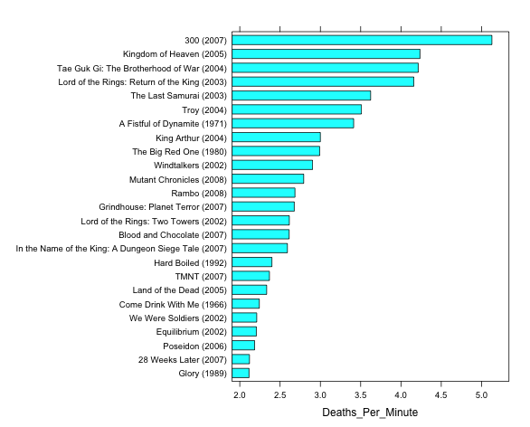
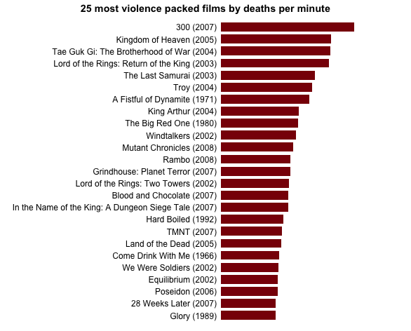
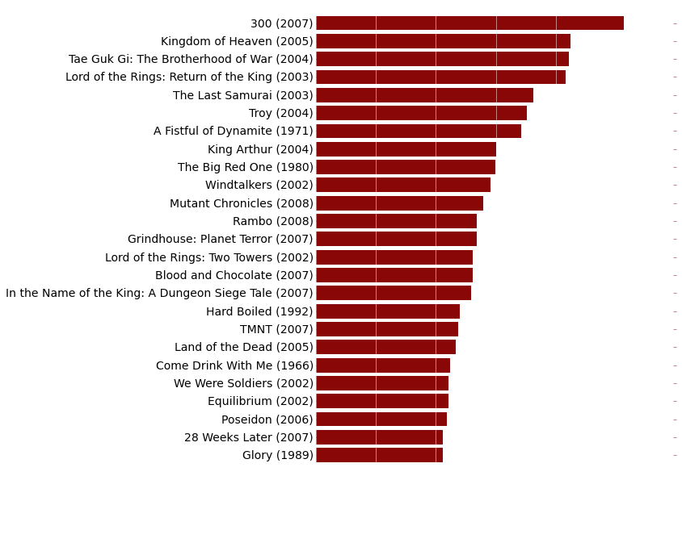
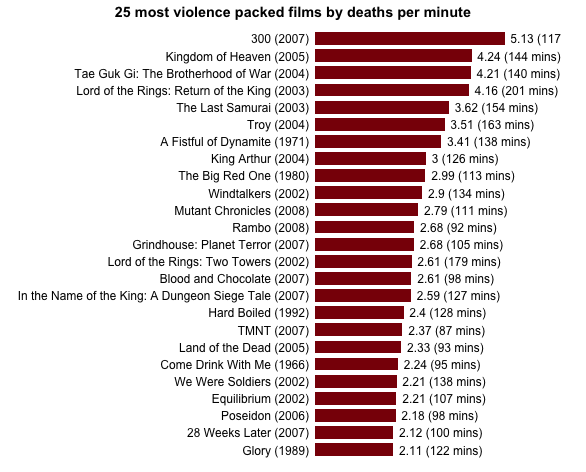
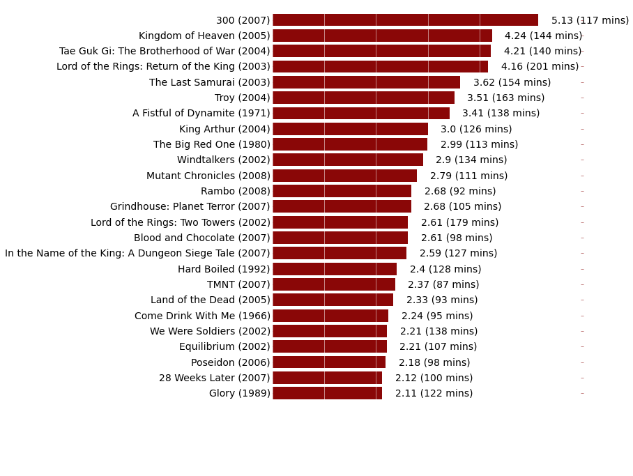
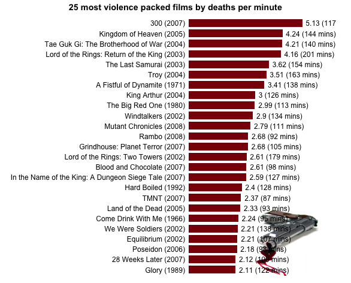

#R versus Python - Round 1

summary of information as found [here](http://www.theswarmlab.com/r-vs-python-round-1/)

##1 – Introduction

For this first challenge, we will use data collected by Randy for his recent post on the “Top 25 most violence packed films” in the history of the movie industry. For his post, Randy generated a simple horizontal barchart showing the top 25 more violent films ordered by number of on screen deaths per minute. In the rest of this document, we will show you how to reproduce this graph using Python and how to achieve a similar result with R. We will detail the different steps of the process and provide for each step the corresponding code (red boxes for R, green boxes for Python). You will also find the entire codes at the end of this document.
If you think there’s a better way to code this in either language, leave a pull request on our GitHub repository or leave a note with suggestions in the comments below.
And now without further ado, let’s get started!

---

##2 – Step by step process

First thing first, let’s set up our working environment by loading some necessary libraries.

###R Code
```
# Load libraries
library(lattice)        # Very versatile graphics package
library(latticeExtra)   # Addition to "lattice" that makes layering graphs a 
# breeze, and I'm a lazy person, so why not
```

###Python Code
```                        
# This starts the IPython Notebook pylab module, useful for plotting and
# interactive scientific computing
%pylab inline
from pandas import read_csv
```

Now let’s load the data for today’s job. The raw data were scraped by Randy (using Python) from www.MovieBodyCounts.com and he generously provided the result of his hard work on FigShare at this address: http://dx.doi.org/10.6084/m9.figshare.889719.

###R Code
```
# Load data into a data frame
body.count.data <- read.csv("http://files.figshare.com/1332945/film_death_counts.csv")
```

###Python Code
```    
# Read the data into a pandas DataFrame
body_count_data = read_csv("http://files.figshare.com/1332945/film_death_counts.csv")
```

For each movie, the data frame contains a column for the total number of on screen deaths (“Body_Count”) and a column for the duration (“Length_Minutes”). We will now create an extra column for the number of on screen deaths per minute of each movie (“Deaths_Per_Minute”)

###R Code
```
# Compute on screen deaths per minute for each movie. 
body.count.data <- within(body.count.data, { 
  Deaths_Per_Minute <- Body_Count / Length_Minutes
  ord <- order(Deaths_Per_Minute, decreasing = TRUE)  # useful later
})
```

###Python Code
```
# Divide the body counts by the length of the film
body_count_data["Deaths_Per_Minute"] = (body_count_data["Body_Count"].apply(float).values /
                                          body_count_data["Length_Minutes"].values)
```

Now we will reorder the data frame by (descending) number of on screen deaths per minute, and select the top 25 most violent movies according to this criterion.

###R Code
```
# Reorder "body.count.data" by (descending) number of on screen deaths per minute
body.count.data <- body.count.data[body.count.data$ord,]

# Select top 25 most violent movies by number of on screen deaths per minute
body.count.data <- body.count.data[1:25,]
```

###Python Code
```
# Only keep the top 25 highest kills per minute films
body_count_data = body_count_data.sort("Deaths_Per_Minute", ascending=False)[:25]

# Change the order of the data so highest kills per minute films are on top in the plot
body_count_data = body_count_data.sort("Deaths_Per_Minute", ascending=True)
```

In Randy’s graph, the “y” axis shows the film title with the release date. We will now generate the full title for each movie following a “Movie name (year)” format, and append it to the data frame.

###R Code
```
# Combine film title and release date into a new factor column with levels
# ordered by ascending violence
body.count.data <- within(body.count.data, {
  Full_Title <- paste0(Film, " (", Year, ")")
  ord <- order(Deaths_Per_Minute, decreasing = TRUE)
  Full_Title <- ordered(Full_Title, levels = rev(unique(Full_Title[ord])))
})
```

###Python Code
```
# Generate the full titles for the movies: movie name (year)
full_title = []

for film, year in zip(body_count_data["Film"].values, body_count_data["Year"].values):
  full_title.append(film + " (" + str(year) + ")")

body_count_data["Full_Title"] = array(full_title)
```

Now we are ready to generate the barchart. We’re going to start with the default options and then we will make this thing look pretty.

###R Code
```
# Generate base graph
graph <- barchart(Full_Title ~Deaths_Per_Minute, data = body.count.data)
print(graph)
```



###Python Code
```
# Plot the red horizontal bars
rects = plt.barh(range(len(body_count_data["Deaths_Per_Minute"])),
                    body_count_data["Deaths_Per_Minute"],
                    height=0.8,
                    align="center",
                    color="#8A0707",
                    edgecolor="none")


# Add the film labels to left of the bars (y-axis)
yticks(range(len(body_count_data["Full_Title"])), body_count_data["Full_Title"].values, fontsize=14)
```


Ok, now let’s make this pretty.

###R Code
```
# Create theme
my.bloody.theme <- within(trellis.par.get(), {    # Initialize theme with default value
  axis.line$col <- NA                             # Remove axes 
  plot.polygon <- within(plot.polygon, {
    col <- "#8A0606"                              # Set bar colors to a nice bloody red
    border <- NA                                  # Remove bars' outline
  })
  axis.text$cex <- 1                              # Default axis text size is a bit small. Make it bigger
  layout.heights <- within(layout.heights, {
    bottom.padding <- 0                           # Remove bottom padding
    axis.bottom <- 0                              # Remove axis padding at the bottom of the graph
    axis.top <- 0                                 # Remove axis padding at the top of the graph
  })
})

# Update figure with new theme + other improvements (like a title for instance)
graph <- update(
  graph, 
  main = '25 most violence packed films by deaths per minute',  # Title of the barchart
  par.settings = my.bloody.theme,                               # Use custom theme
  xlab = NULL,                                                  # Remove label of x axis
  scales = list(x = list(at = NULL)),                                 # Remove rest of x axis
  xlim = c(0, 6.7),                                             # Set graph limits along x axis to accomodate the additional text (requires some trial and error)
  box.width = 0.75)                                             # Default bar width is a bit small. Make it bigger)

print(graph)
```



###Python Code
```
# Don't have any x tick labels
xticks(arange(0, 5, 1), [""])

# Plot styling

# Remove the plot frame lines
ax = axes()
ax.spines["top"].set_visible(False)
ax.spines["right"].set_visible(False)
ax.spines["left"].set_visible(False)
ax.spines["bottom"].set_visible(False)

# Color the y-axis ticks the same dark red color, and the x-axis ticks white
ax.tick_params(axis="y", color="#8A0707")
ax.tick_params(axis="x", color="white")

ax.xaxis.grid(color="white", linestyle="-")
```



Finally, the last thing we want to add to our graph is the number of deaths per minute and the duration of each movie on the right of the graph.

###R Code
```
# Combine number of on screen death per minute and duration of the movies into a new character string column
body.count.data <- within(body.count.data, {
  Deaths_Per_Minute_With_Length <- paste0(round(body.count.data$Deaths_Per_Minute, digits = 2), " (", body.count.data$Length_Minutes, " mins)")
})

# Add number of on screen deaths per minute and duration of movies at the end of each bar 
graph <- graph + layer(with(body.count.data, 
                            panel.text(
                              Deaths_Per_Minute,                  # x position of the text
                              25:1,                               # y position of the text
                              pos = 4,                            # Position of the text relative to the x and y position (4 = to the right)
                              Deaths_Per_Minute_With_Length)))    # Text to display                                     

# Print graph
print(graph)
```



###Python Code
```
# This function adds the deaths per minute label to the right of the bars
def autolabel(rects):
    for i, rect in enumerate(rects):
        width = rect.get_width()
        label_text = (str(round(float(width), 2)) +
                        " (" + str(body_count_data["Length_Minutes"].values[i]) +
                        " mins)")
        
        plt.text(width + 0.25,
                    rect.get_y() + rect.get_height() / 2.,
                    label_text,
                    ha="left",
                    va="center",
                    fontsize=14)

autolabel(rects)
```




##3 – R bonus
Just for fun, I decided to add to the R graph a little accessory in relation with the general theme of this data set.

###R Code
```
# Load additional libraries
library(jpeg)  # To read JPG images
library(grid)  # Graphics library with better image plotting capabilities

# Download a pretty background image; mode is set to "wb" because it seems that
# Windows needs it. I don't use Windows, I can't confirm
download.file(url = "http://www.theswarmlab.com/wp-content/uploads/2014/01/bloody_gun.jpg", 
              destfile = "bloody_gun.jpg", quiet = TRUE, mode = "wb")

# Load gun image using "readJPEG" from the "jpeg" package
img <- readJPEG("bloody_gun.jpg")

# Add image to graph using "grid.raster" from the "grid" package
graph <- graph +layer_(
  grid.raster(
    as.raster(img),                 # Image as a raster
    x = 1,                          # x location of image "Normalised Parent Coordinates"
    y = 0,                          # y location of image "Normalised Parent Coordinates"
    height = 0.7,                   # Height of the image. 1 indicates that the image height is equal to the graph height
    just = c("right", "bottom")))   # Justification of the image relative to its x and y locations

# Print graph
print(graph)
```




---

### Additional exercises by the same group

R vs Python [Round 2](http://www.theswarmlab.com/r-vs-python-round-2/)

* For this challenge, we will attempt to recover the following pieces of information for each movie listed on www.MovieBodyCounts.com: title, release year, count of on-screen deaths and link to the movie page on www.imdb.com (this will help us for part 2 of this challenge next week). We will detail the different steps of the process and provide for each step the corresponding code (red boxes for R, green boxes for Python). You will also find the entire code at the end of this document.

R vs Python [Round 3](http://www.theswarmlab.com/r-vs-python-round-3/)

* Linear regression is one of the most popular statistical tools, in particular when it comes to detect and measure the strength of trends in time-series (but not only). Today we will show you how to perform a linear regression in R and Python, how to run basic diagnostic tests to make sure the linear regression went well, and how to nicely plot the final result.
* The data we will use today are provided by Quandl. Quandl is a company that collects and organizes time-series datasets from hundred’s of public sources, and can even host your datasets for free. It is like the YouTube of time-series data. Besides having a huge collection of datasets, the nice thing about Quandl is that it provides packages for R and Python (and other languages as well) that make it very easy – one line of code! – to retrieve time-series datasets directly from your favorite data analysis tool. Yeah Quandl!
* The dataset that we will explore contains information about the average contributions of individuals and corporations to the income taxes, expressed as a fraction of the Gross Domestic Produce (GDP). We will use linear regression to estimate the variation of these contributions from 1945 to 2013.