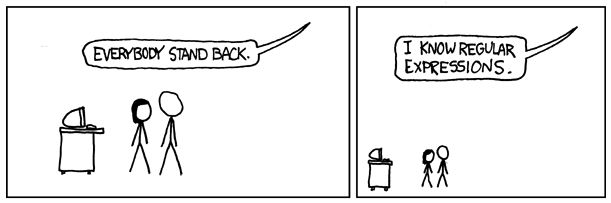

## Stand Back!



## What is a regular expression?

### Notation for describing a set of character strings

Examples

- `foo` matches _foo_
- `[fb]oo` matches _foo_ and _boo_
- `fo*` matches _f_, _fo_, _foo_, ...

## Why is this useful?

### Matching patterns to text lets you...

 * Find data
 * Filter data
 * Validate data
 * Sanitize data

## Examples using ls
```bash
$ ls -1 paleo-mammals*
$ ls -1 paleo-mammals-v?.*
```

## Examples using sed

```bash
$ sed '/Mammuthus/ s/Mammuthus/Mamuthus/g' paleo-mammals.txt
$ sed '/M/ d' paleo-mammals.txt
$ sed '/^M/ d' paleo-mammals.txt
$ sed '/M$/ d' paleo-mammals.txt
$ sed '/Ca.*/ s/K$/M/g' paleo-mammals.txt
```

## Places you might encounter regexes

Editors

- vim, emacs, TextMate, Notepad++, ...

Languages

- e.g. in R: grep, sub, gsub, regexpr

Utilities

- grep, sed, awk, find, locate, ...

## Regular expression: patterns

* Characters
    - `a`, `Z`, `5`, `@`
* Character sets
    - `[aeiou]` some set of characters
    - `[^aeiou]` ...or not those characters!
    - `[a-zA-Z]` ...or a range
    - `[[:alpha:]]` ...or a POSIX character class
* Any character
    - `.`

## Regular expression: patterns

* Anchors
    - `^stuff` at start of line
    - `stuff$` at end of line
    - `\<stuff\>` as its own word
* Quantifiers
    - `?` zero or one
    - `*` zero or more (any)
    - `+` one or more (at least one)
    - `{n}` exactly _n_
    - `{,n}` no more than _n_
    - `{n,}` at least _n_
* Alternation
    - `foo|bar` ...one of two possible patterns


## Escaping

* What does `a+` match?
    - is it the literal {`a+`}?
    - or is it {`a`, `aa`, `aaa`, ...}?
    - answer: it [depends](http://www.regular-expressions.info/refflavors.html)!

* Here are the usual _metacharacters_:
    - `{ } [ ] ( ) ^ $ . | * + ? \`

* When in doubt, test your pattern!
    - try both `a+` and `a\+`

## Other things

* Modifiers
* Greediness
* Grouping
* Backreferences


## Links

* Regex [flavors](http://www.regular-expressions.info/refflavors.html)!
* More on different regex [syntaxes](http://en.wikibooks.org/wiki/Regular_Expressions)
* Regex usage [in vim](http://vimregex.com/)


