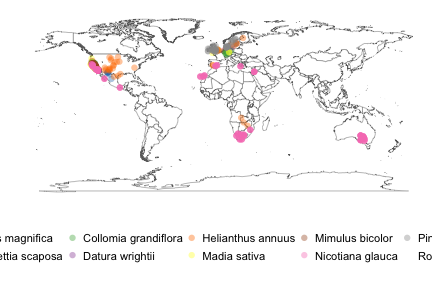

## taxize use case #1

__Submit a list of scientific names to obtain the accepted name across various taxonomic sources. Finally we map their distributions of these species from occurrence records.__


### Load libraries


```r
library(taxize)
library(rgbif)
library(ggplot2)
library(plyr)
```

Most of us will start out with a species list, similar to the one below. Note that are intentionally spelled incorrectly. In a real situation, a researcher might read a `csv`/`xls` file and work through a column of species names.


```r
splist <- c("Helanthus annuus",
"Pinos contorta",
"Collomia grandiflorra",
 "Abies magnificaa",
 "Rosa california",
"Datura wrighti",
"Mimulus bicolour",
"Nicotiana glauca",
"Maddia sativa",
"Bartlettia scapposa")
```

There are many ways to resolve taxonomic names using `taxize`. Of course, the ideal name resolver will do the work behind the scenes for you so that you don't have rely on fuzzy matching. There are a few services in taxize like this we can choose from: the Global Names Resolver service from EOL (see function `gnr_resolve`) and the Taxonomic Name Resolution Service from iPlant (see function `tnrs`). In this case we use the function `tnrs`.


```r
# The tnrs function accepts a single input or a vector
splist_tnrs <- tnrs(query = splist, getpost = "POST")

# Next we remove some extra fields
(splist_tnrs <- splist_tnrs[, !names(splist_tnrs) %in% c("matchedName", "annotations", "uri")])

# At this point pay attention to the scores. They suggest that there were no perfect matches, but almost all were extremely close, ranging from `0.77` to `0.99` (1 being the highest). 
# Let's assume the names in the "acceptedname" column are correct (and they should be in most cases).

# So here's our updated species list
(splist <- as.character(splist_tnrs$acceptedname))
```


|     submittedname     |     acceptedname     |  sourceid   |  score  |     matchedname      |
|:---------------------:|:--------------------:|:-----------:|:-------:|:--------------------:|
|   Helanthus annuus    |  Helianthus annuus   | iPlant_TNRS |  0.98   |  Helianthus annuus   |
|    Pinos contorta     |    Pinus contorta    | iPlant_TNRS |  0.96   |    Pinus contorta    |
| Collomia grandiflorra | Collomia grandiflora | iPlant_TNRS |  0.99   | Collomia grandiflora |
|   Abies magnificaa    |   Abies magnifica    | iPlant_TNRS |  0.98   |   Abies magnifica    |
|    Rosa california    |   Rosa californica   | iPlant_TNRS |  0.99   |   Rosa californica   |
|   "Rosa california"   |      California      |    NCBI     |    1    |  "Rosa california"   |
|    Datura wrighti     |   Datura wrightii    | iPlant_TNRS |  0.98   |   Datura wrightii    |
|   Mimulus bicolour    |   Mimulus bicolor    | iPlant_TNRS |  0.98   |   Mimulus bicolor    |
|  "Nicotiana glauca"   |   Nicotiana glauca   |    NCBI     |    1    |  "Nicotiana glauca"  |
|   Nicotiana glauca    |   Nicotiana glauca   | iPlant_TNRS |    1    |   Nicotiana glauca   |
|     Maddia sativa     |     Madia sativa     | iPlant_TNRS |  0.97   |     Madia sativa     |
|  Bartlettia scapposa  |  Bartlettia scaposa  | iPlant_TNRS |  0.98   |  Bartlettia scaposa  |

Another common task is getting the taxonomic tree upstream from your study taxa. We often know what family or order our taxa are in, but it we often don't know the tribes, subclasses, and superfamilies. taxize provides many avenues to getting classifications. Two of them are accessible via a single function (*classification*): the Integrated Taxonomic Information System (ITIS) and National Center for Biotechnology Information (NCBI); and via the Catalogue of Life (see function *col_classification*):


```r
# Get UIDs for species through NCBI
uids <- get_uid(sciname = splist, verbose = FALSE)

# Let's get classifications from ITIS using Taxonomic Serial Numbers. Note that we could use uBio instead.
class_list <- classification(uids)

# And we can attach these names to our allnames data.frame

gethiernames <- function(x) {
  if(!is.na(x)) {
  temp <- data.frame(t(x[, 1]))
  names(temp) <- x[ , 2]
  temp[, c("kingdom", "phylum", "order", "family")]
}
}
# We name the list using spnames
names(class_list) <- splist
class_df <- ldply(class_list, gethiernames)
allnames_df <- merge(data.frame(splist), class_df, 
  by.x = "splist", 
  by.y = ".id")

# Now that we have allnames_df, we can start to see some relationships among species simply by their shared taxonomic names
allnames_df[1:2, ]
```


|       splist       |    kingdom    |    phylum    |   order   |   family   |
|:------------------:|:-------------:|:------------:|:---------:|:----------:|
|  Abies magnifica   | Viridiplantae | Streptophyta |  Pinales  |  Pinaceae  |
| Bartlettia scaposa | Viridiplantae | Streptophyta | Asterales | Asteraceae |

Using the species list, with the corrected names, we can now search for occurrence data. The Global Biodiversity Information Facility (GBIF) has the largest collection of records data, and has a API that we can interact with programmatically from R.


### Obtain occurences 


```r
occur_list <- occurrencelist_many(as.character(allnames_df$splist), 
  coordinatestatus = TRUE, 
  maxresults = 50,  
  fixnames = "change")
```

### Finally we generate a map


```r
gbifmap_list(occur_list) + 
coord_equal()
```

 
