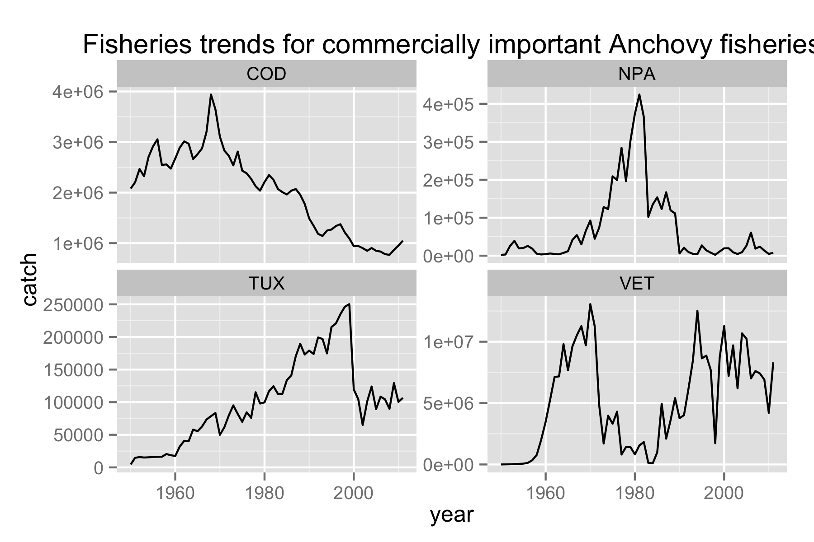

# A complete example of downloading, documenting, and depositing data

```r
library(rfisheries)
library(plyr)
library(reshape2)
library(ggplot2)
```

### First we download fisheries data for 4 commercially important anchovy fisheries

```r
# This function call downloads ~ 11k species names from the open fisheries database (contains FAO landings data)
species <- of_species_codes()
# Then we create a vector of 4 interesting fisheries (all anchovies. Important, not just for pizza)
who <- c("TUX", "COD", "VET", "NPA")
# Next we retrieve 50 years of data for each of these species using the lapply function on the who list.
by_species <- lapply(who, function(x) of_landings(species = x))
# We name the list of retrieved data with the appropriate species.
names(by_species) <- who
# Now we reorganize the data. melt is a function in reshape2
dat <- melt(by_species, id = c("catch", "year"))[, -5]
```

###  A little bit of data cleanup

```r
# We remove column 3 since it's not very helpful (there are no other idenfiers here besides species)
dat <- dat[-3]
# We rename the columns
names(dat) <- c("catch", "year", "a3_code")
# and write the data to disk
write.csv(dat, file = "dat.csv")
```

### Next we plot the data

```
# We can visualize the data and see what the fisheries trends look like:
ggplot(dat, aes(year, catch)) + 
geom_line() + 
facet_wrap( ~ a3_code, scales = "free_y") +
ggtitle("Fisheries trends for commercially important Anchovy fisheries")
```



### Now we manipulate the data into a useful format with variables typecast correctly
```r
# Now we extract some metadata from this dataset
# We also format some columns appropriately (e.g. the year column)
library(dplyr)
code_names <- species[which(species$a3_code %in% who), ] %>% 
select(a3_code, scientific_name)
codes <- code_names$scientific_name
names(codes) <- code_names$a3_code
dat$year <- as.Date(as.character(dat$year), '%Y')
```


Now we write the `XML` for the data and deposit this to figshare.

### As a last step, we define the columns and the units.

```r
require(EML)
col.defs <- c(catch = "Global Landings of fish", 
              year = "the year for which data was reported", 
              a3_code = "3 digit country code")
```

```r
# We define the units
unit.defs <- list("tonne", "YYYY", codes)
```

```r
# Finally we create a container to upload
# We are in the process of streamlining this step
dats <- data.set(dat, # the data
	col.defs = col.defs,  # the column definitions
	unit.defs = unit.defs) # what their units are
```

```r
# The overall description of the EML file is the abstract (Think of this as a "data publication") 
abstract <- "Landings data for several species by year, from the OpenFisheries database"
```

### Login into figshare

```r
# Logging into figshare
# This will happen automatically for most of you by launching a new browser window

# In this demo, we use the following sandbox credentials.
# This allows us to deposit data into a dummy figshare account that gets wiped clean every night.
options(FigshareToken = "QsqBaOrTBI0wuotW7cTDwAgFvSV1bmNouEoqYdWoYbZAQsqBaOrTXI0wuotW7cTDwA")
options(FigsharePrivateToken = "2gz16wL1Tszh4TY2z6opcQ")
options(FigshareKey = "kCV1UF2V1Bjw01TybvzDCg")
options(FigsharePrivateKey = "dGLFrnXeBjXi6qdsO6vwAg")
```

### Now we are ready to write out the `EML`

```r
eml_write(dat = dats, 
	# Please change this title so your submission appears unique during this workshop
	title = "Fisheries Landings Data for cod", 
	abstract = abstract, 
    creator = "Karthik Ram <karthik@ropensci.org>", # Also change this to your name
    file = "landings.xml") # This is the file we create
 ```
 
###  and finally we upload the data/metadata to figshare 

 ```r
eml_publish("landings.xml", 
	description = abstract, # The abstract we wrote earlier
	categories = "Ecology",  # Assign some categories
    tags = "fisheries",  # and tags
    destination = "figshare",  # This destination is flexible and we will soon support more
    visibility = "private") # Finally choose to make this file private or public
```

