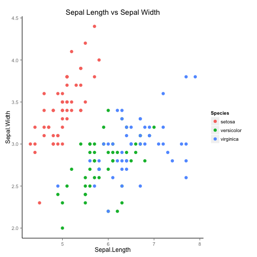

# Report on iris dataset

## Introduction
Lorem ipsum dolor sit amet, consectetur adipisicing elit, sed do eiusmod
tempor incididunt ut labore et dolore magna aliqua. Ut enim ad minim veniam,
quis nostrud exercitation ullamco laboris nisi ut aliquip ex ea commodo
consequat. Duis aute irure dolor in reprehenderit in voluptate velit esse
cillum dolore eu fugiat nulla pariatur. Excepteur sint occaecat cupidatat non
proident, sunt in culpa qui officia deserunt mollit anim id est laborum.


-------------------------------------------
 Sepal.Length   Sepal.Width   Petal.Length 
-------------- ------------- --------------
     5.1            3.5           1.4      

     4.9             3            1.4      

     4.7            3.2           1.3      

     4.6            3.1           1.5      

      5             3.6           1.4      

     5.4            3.9           1.7      
-------------------------------------------


# Figures


```r
ggplot(iris, aes(Sepal.Length, Sepal.Width, color = Species)) + geom_point(size = 3) + 
    ggtitle("Sepal Length vs Sepal Width")
```

 


