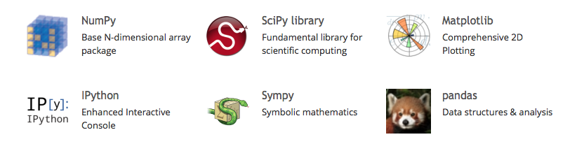

#Scientific Python

---

#NumPy

NumPy is the fundamental package for scientific computing with Python. It contains among other things:

* a powerful N-dimensional array object
* sophisticated (broadcasting) functions
* tools for integrating C/C++ and Fortran code
* useful linear algebra, Fourier transform, and random number capabilities

Besides its obvious scientific uses, NumPy can also be used as an efficient multi-dimensional container of generic data. Arbitrary data-types can be defined. This allows NumPy to seamlessly and speedily integrate with a wide variety of databases.

---

#SciPy

SciPy is a library that uses NumPy for more mathematical functions. SciPy uses NumPy arrays as the basic data structure, and comes with modules for various commonly used tasks in scientific programming, including linear algebra, integration (calculus), ordinary differential equation solving and signal processing.

---
#Matplotlib

Matplotlib is a flexible plotting library for creating interactive 2D and 3D plots that can also be saved as manuscript-quality figures. The API in many ways reflects that of MATLAB, easing transition of MATLAB users to Python. Many examples, along with the source code to re-create them, are available in the matplotlib gallery.

---
#IPython

IPython provides a rich architecture for interactive computing with:

* Powerful interactive shells (terminal and Qt-based).
* A browser-based notebook with support for code, text, mathematical expressions, inline plots and other rich media.
* Support for interactive data visualization and use of GUI toolkits.
* Flexible, embeddable interpreters to load into your own projects.
* Easy to use, high performance tools for parallel computing.

---
#Sympy

SymPy is a Python library for symbolic mathematics. It aims to become a full-featured computer algebra system (CAS) while keeping the code as simple as possible in order to be comprehensible and easily extensible. SymPy is written entirely in Python and does not require any external libraries.

---

#Pandas

Pandas is data manipulation library based on Numpy which provides many useful functions for accessing, indexing, merging and grouping data easily. The main data structure (DataFrame) is close to what could be found in the R statistical package; that is, heterogeneous data tables with name indexing, time series operations and auto-alignment of data.

---

#Rpy2

Rpy2 is a Python binding for the R statistical package allowing the execution of R functions from Python and passing data back and forth between the two environments. Rpy2 is the object oriented implementation of the Rpy bindings.

---
#SciPy & Packages

Installation of scientific Python packages can be troublesome... these are a couple scientific Python distributions which provide precompiled and easy-to-install collections of scientific Python packages.

###Anaconda

* Continuum Analytics offers the Anaconda Python Distribution which includes all the common scientific Python packages as well as many packages related to data analytics and big data. Anaconda itself is free, licenses for the add-ons are available for academics and researchers.

###Canopy

* Canopy is another scientific Python distribution, produced by Enthought. A limited ‘Canopy Express’ variant is available for free, but Enthought charges for the full distribution. Free licenses are available for academics.

---

