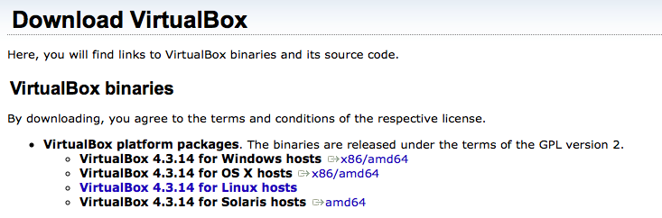
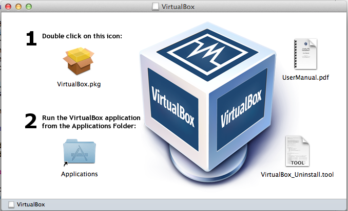
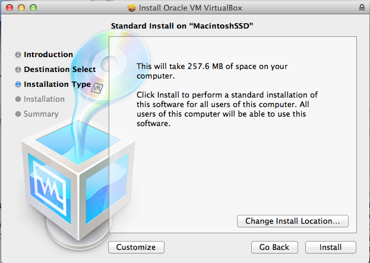
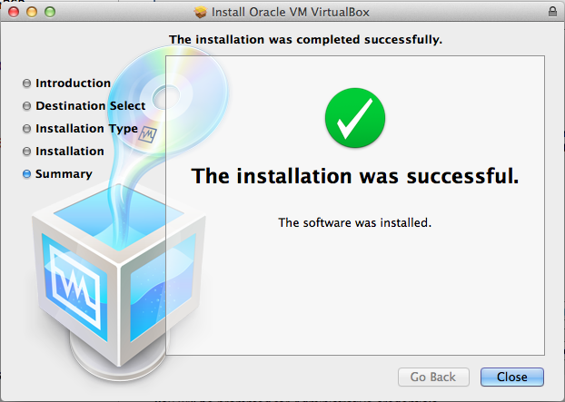
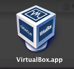
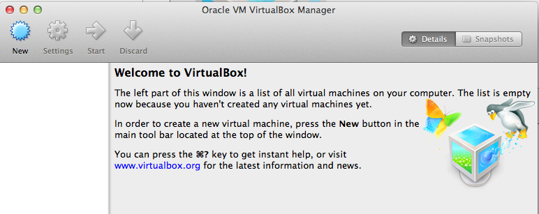
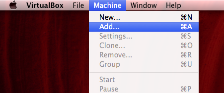
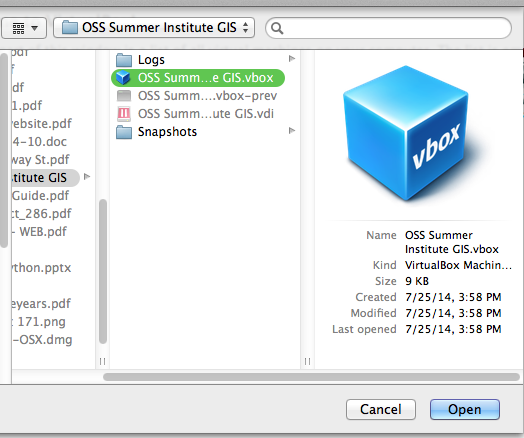
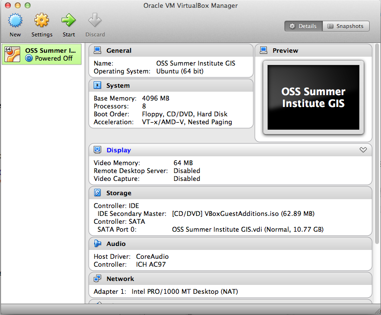
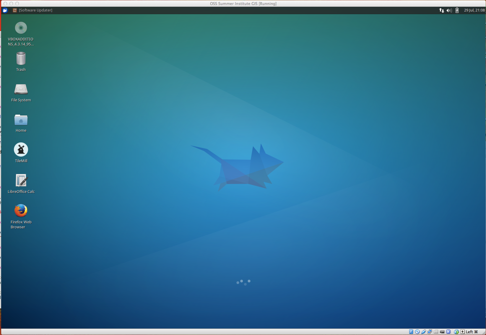

#Local Virtual Environment Setup

###VirtualBox

VirtualBox is a powerful x86 and AMD64/Intel64 virtualization product for enterprise as well as home use. Not only is VirtualBox an extremely feature rich, high performance product for enterprise customers, it is also the only professional solution that is freely available as Open Source Software under the terms of the GNU General Public License (GPL) version 2. See "About VirtualBox" for an introduction.

Presently, VirtualBox runs on Windows, Linux, Macintosh, and Solaris hosts and supports a large number of guest operating systems including but not limited to Windows (NT 4.0, 2000, XP, Server 2003, Vista, Windows 7, Windows 8), DOS/Windows 3.x, Linux (2.4, 2.6 and 3.x), Solaris and OpenSolaris, OS/2, and OpenBSD.

###Install VirtualBox

Download the version of [VirtualBox](https://www.virtualbox.org/wiki/Downloads) required for your platform

In the case of OS X, this file will be called *VirtualBox-4.3.14-95030-OSX.dmg* (122 MB)

Run the installer

You will be prompted for Administrative credentials

If all goes well you'll see the standard success window

You should now see the VirtualBox.app in the Applications Folder

###Download a copy of the VM

* Ideally only a few would download and then share the files via USB storage to minimize download times
* Link to [VM](http://people.renci.org/~stealey/OSS2014/OSS2014VM.zip)
* Unzip the *OSS2014VM.zip* file (1.73 GB) resulting in *OSS Summer Institute GIS* directory (6.15 GB)
	* This directory can be unzipped to anywhere in your local file system that you prefer
	
###Launch VirtualBox

You should be greeted with a welcome message in the VirtualBox Manager window 

At this point we don't want to create a new VM, rather we want to use or **Add** the VM image that we downloaded

Select **Add...** from the Machine dropdown option

Navigate to the directory that you unzipped earliers and select the file called *OSS Summer Institute GIS.vbox* and press open

The VM information should now be visible in the VirtualBox Manager window

Feel free to browse the information and look over the settings. You should not need to change any of the parameters in the settings window.

Next, launch the VM by pressing the green Start arrow. You should see a window open up and the Xubuntu OS display information as it boots into desktop mode

When boot is complete you should have something like this

If so, we're done!