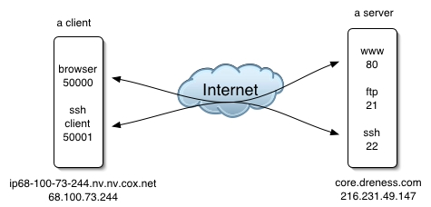
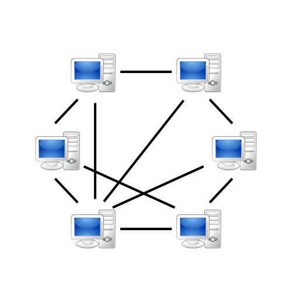
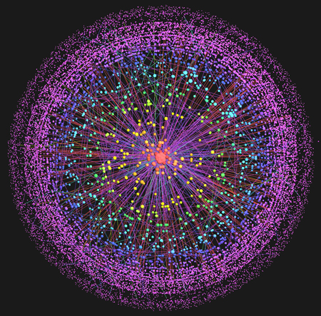

# Computers, Servers, and Networks

## \ 

## Synthesis and Collaboration 

> * Facilitated by computing and networking

## Or goal is to:

> * Provide basic background on computer networking to lay groundwork for later work on collaboration techniques that use the Internet

# Basic Client Server networking

> * Host computers connect via networking equipment
* Can send messages to each other over communication protocols
* Client: the host *initiating* the request
* Server: the host *responding* to a request

# Client-Server networks

# Routing

# Client-Server and the Internet

# Peer to Peer networking

# The Internet

## 

# Internet versus the Web

> * Who knows the difference?

# Visualizing the Internet

# Routing on the internet

> * 80 routers at the core
* dense "mantle" of routers at the periphery
    - loss of the core still leaves > 70% of internet connected peer-to-peer
    - see http://www.technologyreview.com/news/408104/mapping-the-internet/

# Internet Application Protocols

> * Web (http)
* Email (smtp)
* Secure Shell (ssh)
* Telnet (telnet)
* File Transfer Protocol (ftp)
* Network News (nntp)
* ...

# The Web

> * Classic request/response model, no connection

# Secure Shell

> * Classic connection model

