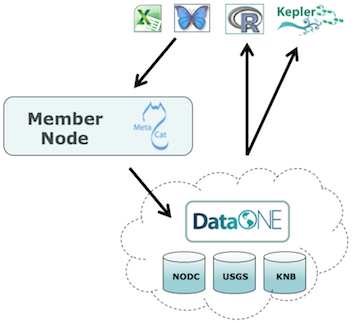
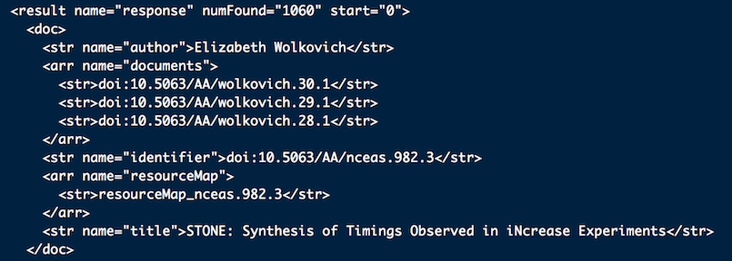

# Accessing data from DataONE using R

## \ 

## Goal of this presentation:

> * Promote understanding of DataONE model and architecture
* Illustrate access to DataONE hosted data sets using the R dataone package

# DataONE Data Flow

# Data Packages

# R "dataone" library functions

> * Search DataONE for data of interest
* Download individual data files and associated metadata
* Download complete data packages (data and metadata)
* Create new data packages on Member Nodes

# Searching DataONE

> * DataONE supports SOLR query syntax
* Results returned are list of data packages
* Includes identifiers for:
    - Package (resource map)
    - Science Metadata
    - Data objects

# Search results

