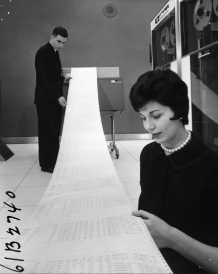

`reshape2` intro for NCEAS SI
========================================================

## Preliminaries

[Slides from Jeff Breen](http://www.slideshare.net/jeffreybreen/reshaping-data-in-r)




```r
library("reshape2")
library("stringr")
sessionInfo()
```

```
## R Under development (unstable) (2013-05-22 r62774)
## Platform: i686-pc-linux-gnu (32-bit)
## 
## locale:
##  [1] LC_CTYPE=en_CA.UTF-8       LC_NUMERIC=C              
##  [3] LC_TIME=en_CA.UTF-8        LC_COLLATE=en_CA.UTF-8    
##  [5] LC_MONETARY=en_CA.UTF-8    LC_MESSAGES=en_CA.UTF-8   
##  [7] LC_PAPER=C                 LC_NAME=C                 
##  [9] LC_ADDRESS=C               LC_TELEPHONE=C            
## [11] LC_MEASUREMENT=en_CA.UTF-8 LC_IDENTIFICATION=C       
## 
## attached base packages:
## [1] stats     graphics  grDevices utils     datasets  methods   base     
## 
## other attached packages:
## [1] stringr_0.6.2  reshape2_1.2.2 knitr_1.2     
## 
## loaded via a namespace (and not attached):
## [1] digest_0.6.3   evaluate_0.4.3 formatR_0.7    plyr_1.8      
## [5] tools_3.1.0
```


## Reshaping data

### Long
* often required by analysis software (almost all R modeling), some graphics software (`ggplot2`)
* unambiguous ("denormalized")

### Short
* less redundant information
* maybe what you got from a data source
* maybe harder for humans/data entry

## Theory

* One long format, many short formats
* *melting* converts wide to long; *casting* converts long to wide
* formula interface: LHS are used as multiple columns (identifying rows); RHS are used as a single header row (in combinations, identifying columns)
* only one datum per cell -- but may want to *aggregate* (data reduction/summarization)


```r
dat <- read.csv("data/renesting2.csv")
head(dat)
```

```
##   Interval..days. X1971 X1972 X1973 X1974 X1975 X1976 X1977 X1978 X1979
## 1               5     0     1     1     0     0     0     0     0     0
## 2               6     0     4     2     0     0     1     0     3     0
## 3               7     0     4     0     0     0     1     0     1     2
## 4               8     0     0     1     0     0     1     0     0     2
## 5               9     4     2    18     0     2     0     0    13     5
## 6              10    36    38    58    15    16    53    19   191    32
##   X1980 X1981 X1982 X1983 X1984 X1985 X1986 X1987 X1988 X1989 X1990 X1991
## 1     1     0     2     1     0     9     3     0     1     4     0     2
## 2     1     0     3     2     2     1     0     0     0     0     0     2
## 3     4     0     0     0     2     0     8     0     3     3     0     2
## 4     3     2     2     0     0     0     2     0     3     0     0     5
## 5    69    14    13    33    10     3    31     6    97     9    13    12
## 6   351    66   198   230   104    86   299    74   431    89   130   134
##   X1992 Row.Totals
## 1     0         18
## 2     2         27
## 3     1         26
## 4     3         20
## 5     1        347
## 6    66       2608
```


(Column names mangled: we'll worry about this later)

```r
names(dat)[1] <- "interval"
dat <- dat[1:(ncol(dat)-1)]  ## drop last column (row totals)
```

(Could use `grep("^X[0-9]{4}",names(dat))` to pull out the correct columns)


```r
mdat1 <- melt(dat,id.var="interval")
```

We need to tell `melt` that we want to preserve the first column (the default rule is to use *all factors* as ID variables)


```r
head(mdat1)
```

```
##   interval variable value
## 1        5    X1971     0
## 2        6    X1971     0
## 3        7    X1971     0
## 4        8    X1971     0
## 5        9    X1971     4
## 6       10    X1971    36
```


```r
dcast(mdat1,interval~variable)
```


```
## 'data.frame':	61 obs. of  23 variables:
##  $ interval: int  5 6 7 8 9 10 11 12 13 14 ...
##  $ X1971   : int  0 0 0 0 4 36 57 54 36 26 ...
##  $ X1972   : int  1 4 4 0 2 38 155 193 112 47 ...
##  $ X1973   : int  1 2 0 1 18 58 98 71 33 18 ...
##  $ X1974   : int  0 0 0 0 0 15 16 35 37 12 ...
## ...
```


* `dcast(mdat1,variable~interval)` casts the other way (we've transposed the original data)
* `acast()` recasts the variable as an *array* (possibly multidimensional)

Formula magic: `~.` means "no variable"

```r
head(dcast(mdat1,variable~.))
```

```
## Aggregation function missing: defaulting to length
```

```
##   variable NA
## 1    X1971 61
## 2    X1972 61
## 3    X1973 61
## 4    X1974 61
## 5    X1975 61
## 6    X1976 61
```

Warning means that we have more than one datum per casting combination, so we have to do something with them ... specify `fun.aggregate`. (Sometimes we actually *want* to count -- this is a roundabout way to replicate the functionality of `table()` -- but if we want `length()` as the aggregation function, we should use it.)


```r
mdat1B <- dcast(mdat1,variable~.,
                fun.aggregate=mean,na.rm=TRUE)
head(mdat1B)
```

```
##   variable     NA
## 1    X1971  5.787
## 2    X1972 14.492
## 3    X1973  7.738
## 4    X1974  3.311
## 5    X1975  4.131
## 6    X1976 18.836
```


(Naming is messed up, I don't know how to set this automatically, but `plyr::rename` and `setNames` are useful.)


```r
names(mdat1B)[2] <- "value"
```


## Tricks

### numbers as column names: 
 * post-conversion: `as.numeric(gsub("^X","",as.character(value)))` or `stringr::str_extract("[0-9]{4}",as.character(value))`
 * use `check.names=FALSE`

### recovering information from columns

```
##   year site1_temp site1_pH site2_temp site2_pH
## 1 2012         25      6.2         27      6.5
## 2 2013         20      6.1         29      5.4
```


```r
(mdat2 <- melt(ex,id.var="year"))
```

```
##   year   variable value
## 1 2012 site1_temp  25.0
## 2 2013 site1_temp  20.0
## 3 2012   site1_pH   6.2
## 4 2013   site1_pH   6.1
## 5 2012 site2_temp  27.0
## 6 2013 site2_temp  29.0
## 7 2012   site2_pH   6.5
## 8 2013   site2_pH   5.4
```

We need to split the `variable` column into separate `site` and `var` columns.


```r
(cc <- colsplit(mdat2$variable,"_",names=c("site","var")))
```

```
##    site  var
## 1 site1 temp
## 2 site1 temp
## 3 site1   pH
## 4 site1   pH
## 5 site2 temp
## 6 site2 temp
## 7 site2   pH
## 8 site2   pH
```


We might want sites to be `{1,2}` rather than `{site1,site2}` (especially if the columns were e.g. `{altitude_100,altitude_200}`,: use `str_extract` (could also use `gsub()` to get rid of the stuff we don't want):


```r
cc$site <- as.numeric(str_extract(as.character(cc$site),
                                   "[0-9]+"))
```


Now put the pieces back together (`with()` is "syntactic sugar"):

```r
mdat2B <- with(mdat2,data.frame(year,cc,value))
```


Now we'll recast (since we probably want `site` and `year` as ID variables, but not `var`):

```r
dcast(mdat2B,year+site~var)
```

```
##   year site  pH temp
## 1 2012    1 6.2   25
## 2 2012    2 6.5   27
## 3 2013    1 6.1   20
## 4 2013    2 5.4   29
```


## Odds and ends

* `reshape` vs. `reshape2`: `reshape2` is faster; uses `dcast()`/`acast()` instead of `cast()`; some functionality missing (multi-valued aggregation).  Just use `reshape2`.
* `...` variable: "all other variables"
* variables sometimes get turned into factors during a `melt`/`cast` cycle
* base R has `utils::stack()/unstack()`, `stats::reshape()`, but I can never remember how they work; `reshape2` is a Swiss Army knife
* works for simple data aggregation/summarization (but also see `aggregate`, `tapply` in base R; `plyr::ddply`, `doBy::summaryBy`, `data.table`, `Hmisc::summary.formula`, `sqldf` packages([StackOverflow example](http://stackoverflow.com/questions/7449198/quick-elegant-way-to-construct-mean-variance-summary-table)))

## Questions/examples/how would I ... ?


