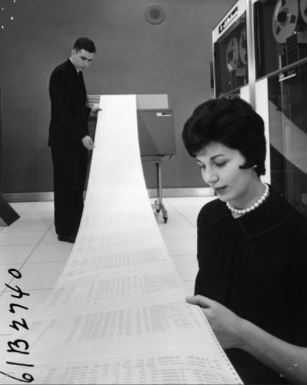

`reshape2` intro for NCEAS SI
========================================================

## Preliminaries

[Slides from Jeff Breen](http://www.slideshare.net/jeffreybreen/reshaping-data-in-r)



```{r opts,echo=FALSE}
opts_chunk$set(tidy=FALSE) ## keep R formatting as I typed it
```

```{r pkgs,message=FALSE}
library("reshape2")
library("stringr")
sessionInfo()
```

## Reshaping data

### Long
* often required by analysis software (almost all R modeling), some graphics software (`ggplot2`)
* unambiguous ("denormalized")

### Short
* less redundant information
* maybe what you got from a data source
* maybe harder for humans/data entry

## Theory

* One long format, many short formats
* *melting* converts wide to long; *casting* converts long to wide
* formula interface: LHS are used as multiple columns (identifying rows); RHS are used as a single header row (in combinations, identifying columns)
* only one datum per cell -- but may want to *aggregate* (data reduction/summarization)

```{r ex1}
dat <- read.csv("data/renesting2.csv")
head(dat)
```

(Column names mangled: we'll worry about this later)
```{r}
names(dat)[1] <- "interval"
dat <- dat[1:(ncol(dat)-1)]  ## drop last column (row totals)
```
(Could use `grep("^X[0-9]{4}",names(dat))` to pull out the correct columns)

```{r}
mdat1 <- melt(dat,id.var="interval")
```
We need to tell `melt` that we want to preserve the first column (the default rule is to use *all factors* as ID variables)

```{r}
head(mdat1)
```

```{r eval=FALSE}
dcast(mdat1,interval~variable)
```

```{r echo=FALSE}
## kluge to get the equivalent of head(str(...))
cat(c(head(capture.output(str(dcast(mdat1,interval~variable)))),"..."),sep="\n")
```

* `dcast(mdat1,variable~interval)` casts the other way (we've transposed the original data)
* `acast()` recasts the variable as an *array* (possibly multidimensional)

Formula magic: `~.` means "no variable"
```{r}
head(dcast(mdat1,variable~.))
```
Warning means that we have more than one datum per casting combination, so we have to do something with them ... specify `fun.aggregate`. (Sometimes we actually *want* to count -- this is a roundabout way to replicate the functionality of `table()` -- but if we want `length()` as the aggregation function, we should use it.)

```{r}
mdat1B <- dcast(mdat1,variable~.,
                fun.aggregate=mean,na.rm=TRUE)
head(mdat1B)
```

(Naming is messed up, I don't know how to set this automatically, but `plyr::rename` and `setNames` are useful.)

```{r}
names(mdat1B)[2] <- "value"
```

## Tricks

### numbers as column names: 
 * post-conversion: `as.numeric(gsub("^X","",as.character(value)))` or `stringr::str_extract("[0-9]{4}",as.character(value))`
 * use `check.names=FALSE`

### recovering information from columns
```{r echo=FALSE}
(ex <- read.table(text="
year site1_temp site1_pH site2_temp site2_pH
2012    25      6.2        27         6.5
2013    20      6.1        29         5.4
",header=TRUE))
```
```{r}
(mdat2 <- melt(ex,id.var="year"))
```
We need to split the `variable` column into separate `site` and `var` columns.

```{r}
(cc <- colsplit(mdat2$variable,"_",names=c("site","var")))
```

We might want sites to be `{1,2}` rather than `{site1,site2}` (especially if the columns were e.g. `{altitude_100,altitude_200}`,: use `str_extract` (could also use `gsub()` to get rid of the stuff we don't want):

```{r str_extract}
cc$site <- as.numeric(str_extract(as.character(cc$site),
                                   "[0-9]+"))
```

Now put the pieces back together (`with()` is "syntactic sugar"):
```{r}
mdat2B <- with(mdat2,data.frame(year,cc,value))
```

Now we'll recast (since we probably want `site` and `year` as ID variables, but not `var`):
```{r}
dcast(mdat2B,year+site~var)
```

## Odds and ends

* `reshape` vs. `reshape2`: `reshape2` is faster; uses `dcast()`/`acast()` instead of `cast()`; some functionality missing (multi-valued aggregation).  Just use `reshape2`.
* `...` variable: "all other variables"
* variables sometimes get turned into factors during a `melt`/`cast` cycle
* base R has `utils::stack()/unstack()`, `stats::reshape()`, but I can never remember how they work; `reshape2` is a Swiss Army knife
* works for simple data aggregation/summarization (but also see `aggregate`, `tapply` in base R; `plyr::ddply`, `doBy::summaryBy`, `data.table`, `Hmisc::summary.formula`, `sqldf` packages([StackOverflow example](http://stackoverflow.com/questions/7449198/quick-elegant-way-to-construct-mean-variance-summary-table)))

## Questions/examples/how would I ... ?


