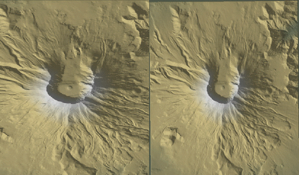
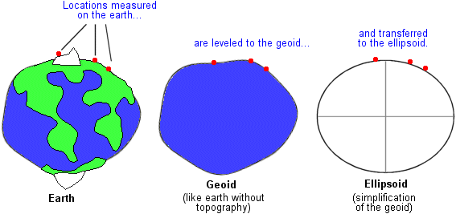
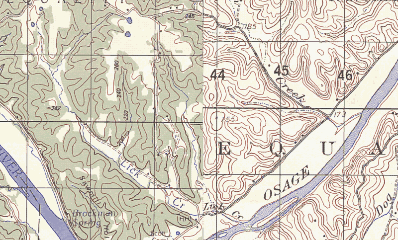

# Intro to geospatial

# Demystifying _spatial_

* We all work with a variety of data
    - Table of trait means for different plants
    - Matrix of species presence/absence by site
    - Time series of flow volume at a river gauge
* Geospatial data are data too!
    - ...but they happen to have:
        - info about geographic locations of observations
        - info about spatial relationships among them
    - ...and therefore we can:
        - visualize the data in map form ("layers")
        - combine date based on shared location
        - Do analyses that exploit spatial relationships

# Digital representations of spatial data

## 1. Vector
## 2. Raster

# Vector data

* Conceptually, a set of discrete objects
* Simplified representation:
    - Points (rain gauges, animal capture locations)
    - Lines (continuous transects, streams, roads)
    - Polygons (watersheds, patches, species ranges)
* Each 'object' can have multiple attributes
* Topology _may_ be explicit and enforced
    - linear networks, polygon adjacency

# Raster data

* Conceptually, a 'field' view of the world
* Simplified representation
    - Regular grid, typically one value per cell ("pixel")
    - e.g. satellite imagery, digital terrain, interpolated surfaces
* Each pixel usually has a single-valued attribute
    - binary, categorical, continues, etc
* Topology is implicitly defined

# Map projections

* Representing the curved Earth in 2D
    - Imagine flattening a ping-pong ball

* Why?
    - Printing on paper
    - Viewing on screen
    - Many calculations are faster/simpler

# Map projections

### Projection involves distortion

# Map projections

* Choice of projection involves trade-offs
    - Preserve shape? or area?
    - Over what map extent?
* Also need to choose coordinate system
    - Where is the origin?
    - What are the units?

# Map projections

* Data don't _**need**_ to be projected
    - "Geographic projection": latitude-longitude
    - Computers aren't constrained to 2D!
    - ...but in practice, most software apps are limited

# Dealing with projections

* You need to know the projection of your data!
* Changing projections:
    - Some software can project "on the fly"
        - convenient, but can cause confusion
    - Software for reprojection
    - Vector: trivial
    - Raster: can involve "warping"

# Raster warping

### Raster resampling

# Geodetic Datums

#### Where is lat 34.419, lon -119.699?

* We can't just model earth as a sphere
    - to Ellipsoid: squashed, spheroidal shape
    - to Geoid: lumpy surface, even at mean sea level
    - (for now, ignore real topography)

# Geodetic Datums

**Datum**: Links coordinates on a reference geoid with actual locations
on earth

* WGS84, NAD83 both common
    - Align to within 1m of each other
    - Both are based on GRS80
* Older spatial data may use older datums
* Local datums provide more accuracy in given place
    - but probably more than you'll ever need!

* **Caution**: Interpreting location using the wrong datum can result
  in positional error of up to 100's of meters!

# Using the wrong datum

# Data storage formats

* Considerable variation in terms of
    - Portability (open standard? proprietary?)
    - Compression type and storage size
    - Flexibility
    - Ability to embed metadata

# Data storage formats -- vectors

> * **ESRI Shapefile**: multi-file format
* **KML**: XML-based format popularized by Google
* **ESRI Personal GeoDatabase**: extends Access databases (ick!)
* CSV??? (at least for point data...)
* [many other lesser known](http://www.gdal.org/ogr/ogr_formats.html)

# Data storage formats -- rasters

> * **ASCII grid**: text matrix with header rows
* **GeoTIFF**: binary image format with geo metadata
* **Arc/Info binary grid**: proprietary binary format, multi-file
* **NetCDF**: flexible container for array data
* _**many others**_: img, bil, grib, [lots more](http::/http://www.gdal.org/formats_list.html)
