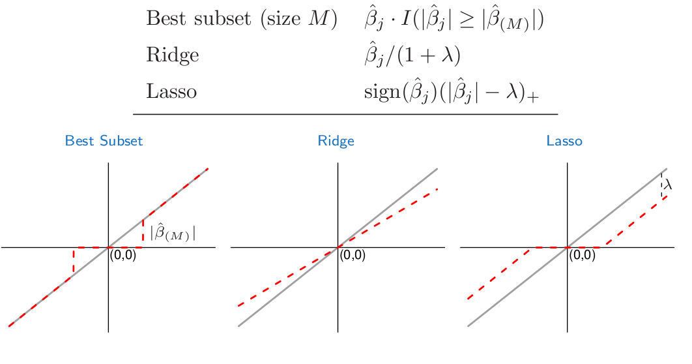

The linear model and extensions
========================================================

```{r opts,echo=FALSE}
opts_chunk$set(tidy=FALSE,fig.width=6,fig.height=4)
```

```{r pkgs,echo=FALSE,message=FALSE}
library(ggplot2)
theme_set(theme_bw())
```

The linear model is arguably one of the most important ideas in statistics, both in its own right and as a component of other models.

$$
\begin{split}
Y & \sim \text{Normal}(\mu,\sigma^2) \\
\mu & = X \beta
\end{split}
$$

* assumes:
    * independence
    * linearity
    * constant variance
    * normality
    * input variables measured without error
* even when assumptions are violated, they're often OK *asymptotically* and/or the results may still be *unbiased* (just less efficient)
* transformations can help (Box-Cox) (but see @ohara_not_2010, @warton_arcsine_2011 )
* random-variable format ($\sim$) and matrix format (with the *design matrix* $X$) may be unfamiliar, but are extremely useful
* the model can be solved computationally in a few very standard linear algebra steps. This means it can be solved very efficiently by standard libraries (e.g. [optimized BLAS](http://cran.r-project.org/web/packages/gcbd/vignettes/gcbd.pdf)); it can also be decomposed and solved out-of-memory (e.g. the [biglm package](http://cran.r-project.org/web/packages/biglm/index.html))
* expected responses are a linear function of the *predictor variables* (which may or may not be the same as the *input variables*)
* you can use `model.matrix()` to create the design matrix by specifying the formula and the data

### Linear regression

* $\mu = \beta_0 + \beta_1 x$
* formula: `y~x` (or `y~1+x`)
* Design matrix:
$$
\left(
\begin{array}{cc}
1 & x_1 \\
1 & x_2 \\
1 & x_3 \\
\dots & \dots 
\end{array}
\right)
$$

US crime data: "The variables seem to have been rescaled to convenient numbers."
(M=percentage of males, So=indicator for southern state, Ed=mean years of schooling, Po1=police expenditure in 1960, LF=labour force participation rate)
```{r}
library(reshape2)
data(UScrime,package="MASS")
USsub <- subset(UScrime,select=c(y,M,So,Ed,Po1,LF))
mUS <- melt(USsub,id.var="y")
g0 <- ggplot(mUS,aes(x=value,y=y))+
  facet_wrap(~variable,scale="free_x")+
      geom_point()
g0 + geom_smooth(method="lm")
```
(Note limitation on `ggplot` linear models)

(Note difference between marginal [univariate] 
and multivariate models)

```{r lm1,fig.keep="last",message=FALSE}
lm1 <- lm(y~.,data=USsub)
library(coefplot2)
coefplot2(lm1)
summary(lm1)
```

```{r lm2,fig.keep="last"}
lm2 <- update(lm1,data=as.data.frame(scale(USsub)))
coefplot2(lm2)
```

### Polynomial regression: 

* $\mu = \sum_{i=0}^n \beta_i x_i^n$
* `y~x+I(x^2)` (or `~poly(x,2)` [orthogonal polynomial] or `~poly(x,2,raw=TRUE)`)
* Design matrix:
$$
\left(
\begin{array}{ccccc}
1 & x_1 & x_1^2 & \dots \\
1 & x_2 & x_2^2 & \dots \\
1 & x_3 & x_3^2 & \dots \\
\dots & \dots & \dots & \dots
\end{array}
\right)
$$
* Here (especially if we specify the model with `poly()` we have a single *input* variable $x$, but multiple *predictor* variables ($x$, $x^2$, ...))
* Polynomial models beyond quadratics are probably a bad idea (unstable). Consider splines/GAMs instead (see below).

```{r}
g0 + geom_smooth(method="lm",formula=y~poly(x,2))
```


```{r lm2P,fig.keep="last"}
lm2P <- update(lm2,.~.^2)
coefplot2(lm2P)
```

### ANOVA

* Treatment separately from linear regression is really a historical accident
* $\mu = \beta_0 + \beta_1 I(x=2) + \beta_2 I(x=3) + \ldots$
* `y~f`
* Design matrix (if first observations are in level 1, 2, 2, 3 respectively)
$$
\left(
\begin{array}{ccc}
1 & 0 & 0  \\
1 & 1 & 0  \\
1 & 1 & 0  \\
1 & 0 & 1 \\
\dots & \dots
\end{array}
\right)
$$
* **Contrasts** determine the translation of input variables into dummy (0/1) predictor variables, e.g. treatment (default: differences from baseline) vs. sum-to-zero (differences from mean in a balanced design)
* Interactions are easy to set up (but possibly hard to understand)
    * 'differences in differences'; e.g. the difference among regions in effects of government spending on phosphorus trends of ver time is a (region $\times$ money $\times$ time) interaction. In a before-after-control-impact treatment we are looking at the difference between (after-before) between control and impact sites
    * interpretation of main effects **depends on presence of interactions** ("principle of marginality": [@venables_exegeses_1998]); where is the zero/baseline level? What are the contrasts? As a general rule, avoid "type III sums of squares" issues by centering data [@schielzeth_simple_2010]

## Generalized linear models

$$
\begin{split}
Y & \sim F(g^{-1}(\mu),\phi) \\
\mu & = X \beta
\end{split}
$$
where $F$ is an exponential family probability distribution (e.g. binomial, Poisson, Gamma) with a known mean-variance relationship; $g$ is a *link function* (log, logit, probit ...)
* logistic regression is (by far) the most common, followed by Poisson regression
```{r scrape1,echo=FALSE}
library(stringr)
sscrape <- function(string="logistic+regression") {
    sstring0 <- "http://scholar.google.ca/scholar?as_q=&num=10&btnG=Search+Scholar&as_epq=STRING&as_oq=&as_eq=&as_occt=any&as_sauthors=&as_publication=&as_ylo=&as_yhi=&as_sdt=1.&as_sdtp=on&as_sdts=5&hl=en"
    sstring <- sub("STRING",string,sstring0)
    rr <- readLines(url(sstring))
    ## rr2 <- rr[grep("[Rr]esults",rr)[1]]
    rr2 <- rr
    rstr <- gsub(",","",
                 gsub("</b>.+$","",
                      gsub("^.+[Rr]esults.+of about <b>","",rr2)))
    rstr <- str_extract(rr2,"About [0-9,]+ results")
    as.numeric(rstr)
}
``` 

```{r gscrape,echo=FALSE}
fn <- "gscrape.RData"
## could use a caching solution for Sweave (cacheSweave, weaver package,
##  pgfSweave ... but they're all slightly wonky with keep.source at
##  the moment
if (!file.exists(fn)) {
  gscrape <- sapply(c("generalized+linear+model",
                      "logistic+regression","Poisson+regression","binomial+regression"),sscrape)
  save("gscrape",file=fn)
} else load(fn)
```       
These data were scraped from Google Scholar hits on the relevant search terms.

```{r scrapepix,echo=FALSE,fig.height=3,fig.width=6,message=FALSE}
d <- data.frame(n=names(gscrape),v=gscrape)
d$n <- reorder(d$n,d$v)
ggplot(d,aes(x=v,y=n))+geom_point(size=5)+
    xlim(0.5e4,2e6)+
    scale_x_log10(limits=c(1e4,2e6))+
    geom_text(aes(label=v),colour="red",vjust=2)+
    labs(y="",x="Google Scholar hits")
``` 
* iteratively reweighted least squares
* extensions: bias-reduced, Tweedie, negative binomial, zero-inflated/hurdle
* example: from [@Tiwari+2005]
```{r tiwari}
dat <- read.csv("data/dufemalepers.csv")
dat <- transform(dat,
                 tot=du+notdu,
                 duprop=du/(du+notdu))
ggplot(dat,aes(x=density,y=duprop))+geom_point(aes(size=tot),alpha=0.5)+
    geom_smooth(data=subset(dat,duprop>0),
                method="glm",formula=y~I(1/x),aes(weight=tot),
                family=quasibinomial(link="inverse"),
                fullrange=TRUE)
```

## Generalized additive models

* allow splines: generalized additive models
* really still "just" linear models
* model complexity (number of knots); can be chosen by AIC
* `splines` package: `ns`, `bs`, `periodicSpline`; specify input variable and number of knots (knot placement is done automatically)
* or *smoothing splines* (`mgcv` package); use lots of knots, shrink via penalization (generalized cross-validation) 
* multidimensional splines, e.g. tensor product ...
* highly efficient -- can model small-scale spatial variation (vs correlation, see below)
* see @wood_generalized_2006
```{r}
ggplot(dat,aes(x=density,y=duprop))+geom_point(aes(size=tot),alpha=0.5)+
    geom_smooth(method="gam",
                aes(weight=tot),
                family=quasibinomial,
                fullrange=TRUE)
```
(GAM doesn't actually do very well here - might possibly be able
to pin it at zero, but that would be difficult ...)

```{r}
mquake <- melt(quakes,id.var="mag")
ggplot(mquake,aes(x=value,y=mag))+
    facet_grid(.~variable,scale="free_x")+
  stat_sum(alpha=0.5,aes(size=..n..))+
  geom_smooth(method="gam")
```

```{r}
ggplot(quakes,aes(x=long,y=lat))+
  geom_point(aes(size=mag,colour=depth),alpha=0.5)
```

## Generalized least squares (correlation and heteroscedasticity)

$$
\begin{split}
Y & \sim MVN(\mu,\Sigma) \\
\mu & = X \beta \\
\Sigma & = f(\theta)
\end{split}
$$
$\Sigma$ is the variance-covariance matrix of the residuals. 

* heteroscedasticity structures: power, exponential, differing by stratum ...
    * generalized least squares
    * $\Sigma$ is diagonal; $\sigma^2_i = f(x_i,\theta)$
    * `f()` can be anything, but chosen to be positive
* correlation structures: temporal, spatial, phylogenetic
    * $\Sigma$ is no longer diagonal: in particular, specify *correlation* structure in terms of $\theta$, e.g. $\rho_{ij}=(t_i-t_j)^{-\theta}$ (AR1 structure)
    * temporal, evenly spaced (ARMA)
    * temporal, uneven sampling (`corCAR1`=exponential decay)
    * spatial: linear, Gaussian, exponential, etc.
    * may measure spatial distance according to great-circle distance (`ramps` package)
* phylogenetic: Brownian, Ornstein-Uhlenbeck ...
* R: `gls`

## Nonlinear least squares

* relax linearity: nonlinear least squares
* lose almost all of the computational advantages
* need to know gory details of optimization algorithms
* starting values!

## Mixed models

* relax independence (groups): mixed models
* random effects defined by group membership ("G-side")
* design matrix for random effects: $X \beta + Z u$
* penalization on $u$, with automatically determined penalty

## Quantile regression

*

```{r}
ggplot(dat,aes(x=density,y=duprop))+geom_point(aes(size=tot),alpha=0.5)+
stat_quantile(formula=y~sqrt(x))
```


## Penalized regression

* ridge regression: penalty of the form $\alpha \sum \beta_i^2$
* lasso: penalty of the form $\alpha \sum |\beta_i|$ (reduces some variables to zero)


## Even more: mix and match
* GAMs include both linear and generalized linear models; can also use GAMMs (generalized additive mixed models)
* spatial (or temporal) GLMMs: put a Poisson (or whatever) layer on top of a correlated MVN
$$
\begin{split}
Y & \sim Distrib(\mu) \\
\mu & \sim g^{-1}(MVN(X \beta,\Sigma)) \\
\Sigma & = f(\theta)
\end{split}
$$




[@hastie_elements_2009]
```{r message=FALSE}
library(glmnet)
resp <- as.matrix(subset(UScrime,select=-c(y,So)))
g1 <- glmnet(resp,UScrime$y,alpha=1)
par(las=1,bty="l")
plot(g1,ylim=c(-10,20))
```
(this is a bad example: penalized regression actually doesn't like correlated predictors!)

* more complex conditional distributions (negative binomial, Tweedie, zero-inflation); may allow linear models for the dispersion parameters as well as the mean
   
